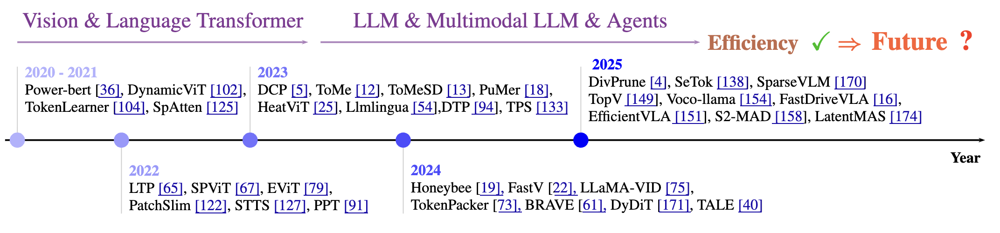

# ⭐ Awesome Token Pruning / Compression / Reduction [](https://github.com/sindresorhus/awesome) [](https://docs.google.com/spreadsheets/d/1tZvQEwK8y3fXRufEsz3VOcUcyBzexTj-x7WLLGIzIMg/edit?usp=sharing)


📚 This repository contains a list of recent papers on token reduction (**token pruning, merging, clustering, compressing, adaptive thinking** etc.) for ML/Gen AI; we categorize them based on their year and application scenarios. 

👀 If you found any **errors** or **missing papers**, please don't hesitate to **open an issue** or **pull request**. We invite your participation in advancing this field.

## 📜 Citation
If you find our work useful for your project, please consider citing our paper and starring this repo.
```
@article{kong2025token,
  title={Token Reduction Should Go Beyond Efficiency in Generative Models--From Vision, Language to Multimodality},
  author={Kong, Zhenglun and Li, Yize and Zeng, Fanhu and Xin, Lei and Messica, Shvat and Lin, Xue and Zhao, Pu and Kellis, Manolis and Tang, Hao and Zitnik, Marinka},
  journal={arXiv preprint arXiv:2505.18227},
  year={2025}
}
```
## 📢 News
- **`2025/12/29`** Added CVPR 2025, NeurIPS 2025, ACL 2025, EMNLP 2025, ICCV 2025, ACM MM 2025, ICME 2025, ICASSP 2025, AAAI 2026.
- **`2025/06/28`** 🔥🔥 Update paper "[Token Reduction Should Go Beyond Efficiency in Generative Models -- From Vision, Language to Multimodality](https://arxiv.org/abs/2505.18227)".
- **`2025/05/25`** 🔥🔥 Checkout our newly released **position** paper "[Token Reduction Should Go Beyond Efficiency in Generative Models -- From Vision, Language to Multimodality](https://arxiv.org/abs/2505.18227)", which demonstrates how token reduction is leveraged for **more than just efficiency gains**, and outlines key future directions.

<p align="center">  </p>

- **`2025/03/24`** Added CVPR 2025, ICLR 2025, WACV 2025, AAAI 2025, EMNLP 2024.

## Table of Contents
A detailed list of papers organized by modality can be found in this [Google Sheet](https://docs.google.com/spreadsheets/d/1tZvQEwK8y3fXRufEsz3VOcUcyBzexTj-x7WLLGIzIMg/edit?usp=sharing), including a brief introduction of the **task, token reduction type, contribution, and methodology** for each paper.

- [🌁 Vision](#vision)
- [📝 Language](#language)
- [🎬 Vision-Language (Action) Model](#vision-language(action)-model)
- [📱 Hardware Co-design](#hardware)


## 🌁 Vision 
<a id="vision"></a>
#### 2026
* [**AAAI'26**] CompTrack: Information Bottleneck-Guided Low-Rank Dynamic Token Compression for Point Cloud Tracking [[Paper](https://arxiv.org/pdf/2511.15580)]
#### 2025
* [**ICASSP'25**] Cross-Layer Cache Aggregation for Token Reduction in Ultra-Fine-Grained Image Recognition [[Paper](https://ieeexplore.ieee.org/document/10890489)] [[Code](https://github.com/arkel23/CLCA)]
* [**ICME'25**] Sparsedm: Toward sparse efficient diffusion models [[Paper](https://arxiv.org/pdf/2404.10445)]
* [**ICME'25**] SPEECHPRUNE: Context-aware Token Pruning for Speech Information Retrieval [[Paper](https://arxiv.org/pdf/2412.12009)]
* [**ICCV'25**] Keyframe-oriented Vision Token Pruning: Enhancing Efficiency of Large Vision Language Models on Long-Form Video Processing [[Paper](https://arxiv.org/pdf/2503.10742)]
* [**CVPR'25**] Faster Parameter-Efficient Tuning with Token Redundancy Reduction [[Paper](https://openaccess.thecvf.com/content/CVPR2025/papers/Kim_Faster_Parameter-Efficient_Tuning_with_Token_Redundancy_Reduction_CVPR_2025_paper.pdf)] [[Code](https://github.com/kyk120/fpet)]
* [**CVPR'25**] AdaCM<sup>2</sup>: On Understanding Extremely Long-Term Video with Adaptive Cross-Modality Memory Reduction [[Paper](https://arxiv.org/pdf/2411.12593v3)]
* [**CVPR'25**] Token Cropr: Faster ViTs for Quite a Few Tasks [[Paper](https://arxiv.org/pdf/2412.00965)]
* [**CVPR'25**] Attend to Not Attended: Structure-then-Detail Token Merging for Post-training DiT Acceleration [[Paper](https://arxiv.org/pdf/2505.11707)] [[Code](https://github.com/ICTMCG/SDTM)]
* [**CVPR'25**] MergeVQ: A Unified Framework for Visual Generation and Representation with Disentangled Token Merging and Quantization [[Paper](https://arxiv.org/pdf/2504.00999)] [[Code](https://apexgen-x.github.io/MergeVQ/)]
* [**CVPR'25**] Rethinking Token Reduction with Parameter-Efficient Fine-Tuning in ViT for Pixel-Level Tasks
* [**CVPR'25**] CATANet: Efficient Content-Aware Token Aggregation for Lightweight Image Super-Resolution [[Paper](https://arxiv.org/abs/2503.06896)]
* [**CVPR'25**] VASparse: Towards Efficient Visual Hallucination Mitigation via Visual-Aware Token Sparsification [[Paper](https://arxiv.org/abs/2501.06553)] [[Code](https://github.com/mengchuang123/VASparse-github)]
* [**CVPR'25**] Faster Parameter-Efficient Tuning with Token Redundancy Reduction [[Paper](https://arxiv.org/abs/2503.20282)]
* [**ICLR'25**] Accelerating Diffusion Transformers with Token-wise Feature Caching [[Paper](https://arxiv.org/pdf/2410.05317)] [[Code](https://github.com/Shenyi-Z/ToCa)]
* [**ICLR'25**] Mutual Effort for Efficiency: A Similarity-based Token Pruning for Vision Transformers in Self-Supervised Learning [[Paper](https://openreview.net/pdf?id=GTcEe5fayC)]
* [**ICLR'25**] Dynamic diffusion transformer [[Paper](https://arxiv.org/pdf/2410.03456)] [[Code](https://github.com/NUS-HPC-AI-Lab/Dynamic-Diffusion-Transformer)]
* [**WACV'25**] Pruning One More Token is Enough: Leveraging Latency-Workload Non-Linearities for Vision Transformers on the Edge  [[Paper](https://arxiv.org/abs/2407.05941)]
* [**ICASSP'25**] Pruning then reweighting: Towards data-efficient training of diffusion models [[Paper](https://ieeexplore.ieee.org/abstract/document/10888554)] [[Code](https://github.com/Yeez-lee/Data-Selection-and-Reweighting-for-Diffusion-Models)]
* [**AAAI'25**] FreqTS: Frequency-Aware Token Selection for Accelerating Diffusion Models [[Paper](https://ojs.aaai.org/index.php/AAAI/article/view/33008)]
* [**AAAI'25**] Multimodal Promptable Token Merging for Diffusion Models [[Paper](https://ojs.aaai.org/index.php/AAAI/article/view/33894)]
* [**AAAI'25**] Training-free and hardware-friendly acceleration for diffusion models via similarity-based token pruning [[Paper](https://ojs.aaai.org/index.php/AAAI/article/view/33071)] [[Code](https://github.com/EvelynZhang-epiclab/SiTo)]
* [arXiv] OminiControl2: Efficient Conditioning for Diffusion Transformers [[Paper](https://arxiv.org/pdf/2503.08280)] [[Code](https://github.com/Yuanshi9815/OminiControl)]
* [arXiv] Token Transforming: A Unified and Training-Free Token Compression Framework for Vision Transformer Acceleration [[Paper](https://arxiv.org/abs/2506.05709)] [[Code](https://github.com/AuroraZengfh/TokenTransforming)]
* [arXiv] Pyramid Sparse Transformer: Efficient Multi-Scale Feature Fusion with Dynamic Token Selection [[Paper](https://arxiv.org/pdf/2505.12772)] [[Code](https://github.com/inlmouse/PyramidSparseTransformer)]
* [arXiv] Cached Adaptive Token Merging: Dynamic Token Reduction and Redundant Computation Elimination in Diffusion Model [[Paper](https://arxiv.org/pdf/2501.00946)] [[Code](https://github.com/omidiu/ca_tome)]
* [arXiv] Layer-and Timestep-Adaptive Differentiable Token Compression Ratios for Efficient Diffusion Transformers [[Paper](https://arxiv.org/pdf/2412.16822)] [[Code](https://github.com/GATECH-EIC/DiffCR)]
* [arXiv] UniCP: A Unified Caching and Pruning Framework for Efficient Video Generation [[Paper](https://arxiv.org/pdf/2502.04393)]
* [arXiv] CAT Pruning: Cluster-Aware Token Pruning For Text-to-Image Diffusion Models [[Paper](https://arxiv.org/pdf/2502.00433)] [[Code](https://github.com/ada-cheng/CAT-Pruning)]
* [arXiv] Concise Reasoning, Big Gains: Pruning Long Reasoning Trace with Difficulty-Aware Prompting [[Paper](https://arxiv.org/pdf/2505.19716)] [[Code](https://github.com/Evanwu1125/LiteCoT)]

#### 2024
* [**NeurIPS'24**] Accelerating Transformers with Spectrum-Preserving Token Merging [[Paper](https://arxiv.org/pdf/2405.16148)]
* [**NeurIPS'24**] Video Token Merging for Long Video Understanding [[Paper](https://arxiv.org/pdf/2410.23782)]
* [**NeurIPS'24**] Don't Look Twice: Faster Video Transformers with Run-Length Tokenization [[Paper](https://arxiv.org/pdf/2411.05222)] [[Code](https://github.com/rccchoudhury/rlt)]
* [**NeurIPSW'24**] M2M-TAG: Training-Free Many-to-Many Token Aggregation for Vision Transformer Acceleration [[Paper](openreview.net/forum?id=LO3Mw8Jrk0)] [[Code](https://github.com/AuroraZengfh/TokenTransforming)]
* [**ECCV'24**] Agglomerative Token Clustering [[Paper](https://arxiv.org/pdf/2409.11923)] [[Code](https://github.com/JoakimHaurum/ATC)] 
* [**ECCV'24**] Token Compensator: Altering Inference Cost of Vision Transformer without Re-Tuning [[Paper](https://arxiv.org/pdf/2408.06798)] [[Code](https://github.com/JieShibo/ToCom)]
* [**ECCV'24**] LookupViT: Compressing visual information to a limited number of tokens [[Paper](https://arxiv.org/pdf/2407.12753)]
* [**ECCV'24**] PYRA: Parallel Yielding Re-Activation for Training-Inference Efficient Task Adaptation [[Paper](https://arxiv.org/abs/2403.09192)] [[Code](https://github.com/THU-MIG/PYRA?tab=readme-ov-file)]
* [**ECCV'24**] Turbo: Informativity-driven acceleration plug-in for vision-language large models [[Paper](https://link.springer.com/chapter/10.1007/978-3-031-72952-2_25)]
* [**ECCV'24**] Object-centric diffusion for efficient video editing [[Paper](https://arxiv.org/pdf/2401.05735)]
* [**ECCV'24**] Leveraging temporal contextualization for video action recognition [[Paper](https://arxiv.org/pdf/2404.09490)] [[Code](https://github.com/naver-ai/tc-clip)]
* [**IJCAI'24**] ToDo: token downsampling for efficient generation of high-resolution images [[Paper](https://www.ijcai.org/proceedings/2024/1036.pdf)]
* [**CVPR'24**] Attention-driven training-free efficiency enhancement of diffusion models [[Paper](https://arxiv.org/pdf/2405.05252)]
* [**CVPR'24**] vid-TLDR: Training Free Token Merging for Light-weight Video Transformer [[Paper](https://openaccess.thecvf.com/content/CVPR2024/papers/Choi_vid-TLDR_Training_Free_Token_Merging_for_Light-weight_Video_Transformer_CVPR_2024_paper.pdf)] [[Code](https://github.com/mlvlab/vid-TLDR)]
* [**CVPR'24**] Vidtome: Video token merging for zero-shot video editing [[Paper](https://arxiv.org/pdf/2312.10656)] [[Code](https://github.com/VISION-SJTU/VidToMe)]
* [**CVPR'24**] Zero-TPrune: Zero-Shot Token Pruning through Leveraging of the Attention Graph in Pre-Trained Transformers [[Paper](https://openaccess.thecvf.com/content/CVPR2024/papers/Wang_Zero-TPrune_Zero-Shot_Token_Pruning_through_Leveraging_of_the_Attention_Graph_CVPR_2024_paper.pdf)] [[Code](https://jha-lab.github.io/zerotprune/)] 
* [**ICLR'24**] Synergistic Patch Pruning for Vision Transformer: Unifying Intra- & Inter-Layer Patch Importance [[Paper](https://openreview.net/pdf?id=COO51g41Q4)]
* [**WACV'24**] Token Fusion: Bridging the Gap Between Token Pruning and Token Merging [[Paper](https://openaccess.thecvf.com/content/WACV2024/papers/Kim_Token_Fusion_Bridging_the_Gap_Between_Token_Pruning_and_Token_WACV_2024_paper.pdf)]
* [**WACV'24**] Revisiting Token Pruning for Object Detection and Instance Segmentation [[Paper](https://openaccess.thecvf.com/content/WACV2024/papers/Liu_Revisiting_Token_Pruning_for_Object_Detection_and_Instance_Segmentation_WACV_2024_paper.pdf)] [[Code](https://github.com/uzh-rpg/svit/)]
* [arXiv] Token Pruning for Caching Better: 9 Times Acceleration on Stable Diffusion for Free [[Paper](https://arxiv.org/pdf/2501.00375)] 
* [arXiv] Vote&Mix: Plug-and-Play Token Reduction for Efficient Vision Transformer [[Paper](https://arxiv.org/pdf/2408.17062)] 
* [arXiv] Dynamic and Compressive Adaptation of Transformers From Images to Videos [[Paper](https://arxiv.org/pdf/2408.06840)]
* [arXiv] Importance-based Token Merging for Diffusion Models [[Paper](https://arxiv.org/pdf/2411.16720)]
* [arXiv] AsymRnR: Video Diffusion Transformers Acceleration with Asymmetric Reduction and Restoration [[Paper](https://arxiv.org/pdf/2412.11706)] [[Code](https://github.com/wenhao728/AsymRnR)]
* [arXiv] Token Caching for Diffusion Transformer Acceleration [[Paper](https://arxiv.org/pdf/2409.18523)]
* [arXiv] FlexDiT: Dynamic Token Density Control for Diffusion Transformer [[Paper](https://arxiv.org/pdf/2412.06028)] [[Code](https://github.com/changsn/FlexDiT)]
* [arXiv] Principles of Visual Tokens for Efficient Video Understanding [[Paper](https://arxiv.org/pdf/2411.13626)] 

#### 2023
* [**EMNLP'23**] TESTA: Temporal-Spatial Token Aggregation for Long-form Video-Language Understanding [[Paper](https://arxiv.org/pdf/2310.19060)] [[Code](https://github.com/RenShuhuai-Andy/TESTA)]
* [**ICCV'23**] Dynamic Token Pruning in Plain Vision Transformers for Semantic Segmentation [[Paper](https://openaccess.thecvf.com/content/ICCV2023/papers/Tang_Dynamic_Token_Pruning_in_Plain_Vision_Transformers_for_Semantic_Segmentation_ICCV_2023_paper.pdf)] [[Code](https://github.com/zbwxp/Dynamic-Token-Pruning)]
* [**ICCV'23**] DiffRate: Differentiable Compression Rate for Efficient Vision Transformers [[Paper](https://arxiv.org/abs/2305.17997)] [[Code](https://github.com/OpenGVLab/DiffRate)]
* [**ICCV'23**] TORE: Token Reduction for Efficient Human Mesh Recovery with Transformer [[Paper](https://openaccess.thecvf.com/content/ICCV2023/papers/Dou_TORE_Token_Reduction_for_Efficient_Human_Mesh_Recovery_with_Transformer_ICCV_2023_paper.pdf)] [[Code](https://github.com/Frank-ZY-Dou/TORE)]
* [**ICCV'23**] Prune spatio-temporal tokens by semantic-aware temporal accumulation [[Paper](https://arxiv.org/pdf/2308.04549)] [[Code](https://github.com/Mark12Ding/STA)]
* [**ICCV'23**] Efficient Video Action Detection with Token Dropout and Context Refinement [[Paper](https://arxiv.org/pdf/2304.08451)] [[Code](https://github.com/MCG-NJU/EVAD)]
* [**ICCV'23** Workshop] Which Tokens to Use? Investigating Token Reduction in Vision Transformers [[Paper](https://arxiv.org/abs/2308.04657)] [[Code](https://github.com/JoakimHaurum/TokenReduction)] 
* [**CVPR'23**] Joint Token Pruning and Squeezing Towards More Aggressive Compression of Vision Transformers [[Paper](https://arxiv.org/pdf/2304.10716)] [[Code](https://github.com/megvii-research/TPS-CVPR2023)]
* [**CVPRW'23**] Token merging for fast stable diffusion [[Paper](https://openaccess.thecvf.com/content/CVPR2023W/ECV/papers/Bolya_Token_Merging_for_Fast_Stable_Diffusion_CVPRW_2023_paper.pdf)] [[Code](https://github.com/dbolya/tomesd)]
* [**ICLR'23**] Token Merging: Your ViT But Faster [[Paper](https://arxiv.org/pdf/2210.09461)] [[Code](https://github.com/facebookresearch/ToMe)]
* [**IJCAI'23**] Adaptive Sparse ViT: Towards Learnable Adaptive Token Pruning by Fully Exploiting Self-Attention [[Paper](https://arxiv.org/pdf/2209.13802)] [[Code](https://github.com/Cydia2018/AS-ViT)]
* [**TIP**] Efficient Vision Transformer via Token Merger [[Paper](https://ieeexplore.ieee.org/stamp/stamp.jsp?tp=&arnumber=10183862)]
* [arXiv] PPT: Token Pruning and Pooling for Efficient Vision Transformers [[Paper](https://arxiv.org/pdf/2310.01812)] [[Code](https://github.com/xjwu1024/PPT)]

#### 2022
* [**ECCV'22**] SPViT: Enabling Faster Vision Transformers via Latency-aware Soft Token Pruning [[Paper](https://www.ecva.net/papers/eccv_2022/papers_ECCV/papers/136710618.pdf)] [[Code](https://github.com/PeiyanFlying/SPViT)] 
* [**ECCV'22**] ATS: Adaptive Token Sampling For Efficient Vision Transformers [[Paper](https://arxiv.org/abs/2111.15667)] [[Code](https://github.com/adaptivetokensampling/ATS)]
* [**ECCV'22**] PPT: token-Pruned Pose Transformer for monocular and multi-view human pose estimation [[Paper](https://arxiv.org/pdf/2209.08194)] [[Code](https://github.com/HowieMa/PPT)]
* [**ECCV'22**] Ts2-net: Token shift and selection transformer for text-video retrieval [[Paper](https://arxiv.org/pdf/2207.07852)]
* [**ECCV'22**] Efficient video transformers with spatial-temporal token selection [[Paper](https://arxiv.org/pdf/2111.11591)] [[Code](https://github.com/wdrink/STTS)]
* [**CVPR'22**] Vision Transformer Slimming: Multi-Dimension Searching in Continuous Optimization Space [[Paper](https://arxiv.org/pdf/2201.00814)] [[Code](https://github.com/Arnav0400/ViT-Slim)]
* [**CVPR'22**] Patch Slimming for Efficient Vision Transformers [[Paper](https://arxiv.org/abs/2106.02852)]
* [**CVPR'22**] A-ViT: Adaptive Tokens for Efficient Vision Transformer [[Paper](https://arxiv.org/pdf/2112.07658)] [[Code](https://github.com/NVlabs/A-ViT)]
* [**ICLR'22**] EViT: Expediting Vision Transformers via Token Reorganizations [[Paper](https://arxiv.org/pdf/2202.07800)] [[Code](https://github.com/youweiliang/evit?tab=readme-ov-file)]
* [**AAAI'22**] Evo-ViT: Slow-Fast Token Evolution for Dynamic Vision Transformer [[Paper](https://arxiv.org/abs/2108.01390)] [[Code](https://github.com/YifanXu74/Evo-ViT)]

#### 2021
* [**NeurIPS'21**] IA-RED2: Interpretability-Aware Redundancy Reduction for Vision Transformers [[Paper](https://arxiv.org/pdf/2106.12620)]
* [**NeurIPS'21**] Tokenlearner: Adaptive space-time tokenization for videos [[Paper](https://proceedings.neurips.cc/paper_files/paper/2021/file/6a30e32e56fce5cf381895dfe6ca7b6f-Paper.pdf)] [[Code](https://github.com/google-research/scenic/tree/main/scenic/projects/token_learner)]
* [**NeurIPS'21**] DynamicViT: Efficient Vision Transformers with Dynamic Token Sparsification [[Paper](https://arxiv.org/abs/2106.02034)] [[Code](https://github.com/raoyongming/DynamicViT)]


## 📝 Language 
<a id="language"></a>
#### 2025
* [arXiv] When Reasoning Meets Its Laws [[Paper](https://arxiv.org/pdf/2512.17901)] [[Code](https://github.com/ASTRAL-Group/LoRe)]
* [arXiv] CARL: Critical Action Focused Reinforcement Learning for Multi-Step Agent [[Paper](https://arxiv.org/pdf/2512.04949)]
* [arXiv] ACON: Optimizing Context Compression for Long-horizon LLM Agents [[Paper](https://arxiv.org/pdf/2510.00615v2)] [[Code](https://github.com/microsoft/acon)]
* [arXiv] PaCoRe: Learning to Scale Test-Time Compute with Parallel Coordinated Reasoning [[Paper](https://github.com/stepfun-ai/PaCoRe/blob/main/pacore_report.pdf)] [[Code](https://github.com/stepfun-ai/PaCoRe/tree/main)]
* [arXiv] Uni-cot: Towards Unified Chain-of-Thought Reasoning Across Text and Vision [[Paper](https://arxiv.org/pdf/2508.05606v2)] [[Code](https://github.com/Fr0zenCrane/UniCoT)]
* [arXiv] Latent Collaboration in Multi-Agent Systems [[Paper](https://arxiv.org/pdf/2511.20639)] [[Code](https://github.com/Gen-Verse/LatentMAS)]
* [arXiv] ARM2: Adaptive Reasoning Model with Vision Understanding and Executable Code [[Paper](https://arxiv.org/pdf/2510.08163)]
* [arXiv] AdaCoT: Pareto-Optimal Adaptive Chain-of-Thought Triggering via Reinforcement Learning [[Paper](https://arxiv.org/pdf/2505.11896)]
* [arXiv] AdaptThink: LLM Can Learn When to Think [[Paper](https://arxiv.org/pdf/2505.13417)] [[Code](https://github.com/THU-KEG/AdaptThink)]
* [arXiv] Qwen3 Technical Report [[Paper](https://arxiv.org/pdf/2505.09388)] [[Code](https://github.com/QwenLM/Qwen3)]
* [**EMNLP'25**] Position IDs Matter: An Enhanced Position Layout for Efficient Context Compression in Large Language Models [[Paper](https://aclanthology.org/2025.findings-emnlp.962.pdf)] [[Code](https://github.com/1azybug/EPL)]
* [**EMNLP'25**] ThinkSwitcher: When to Think Hard, When to Think Fast [[Paper](https://arxiv.org/pdf/2505.14183)]
* [**EMNLP'25**] TokenSkip: Controllable Chain-of-Thought Compression in LLMs [[Paper](https://arxiv.org/pdf/2502.12067)] [[Code](https://github.com/hemingkx/TokenSkip)]
* [**EMNLP'25**] TokenSelect: Efficient Long-Context Inference and Length Extrapolation for LLMs via Dynamic Token-Level KV Cache Selection [[Paper](https://arxiv.org/pdf/2411.02886)] [[Code](https://github.com/pzs19/TokenSelect)]
* [**EMNLP'25**] LightThinker: Thinking Step-by-Step Compression [[Paper](https://arxiv.org/pdf/2502.15589)] [[Code](https://github.com/zjunlp/LightThinker)]
* [arXiv] Scaling Graph Chain-of-Thought Reasoning: A Multi-Agent Framework with Efficient LLM Serving [[Paper](https://arxiv.org/pdf/2511.01633v1)]
* [arXiv] DiffAdapt: Difficulty-Adaptive Reasoning for Token-Efficient LLM Inference [[Paper](https://arxiv.org/pdf/2510.19669)]
* [arXiv] MixReasoning: Switching Modes to Think [[Paper](https://arxiv.org/pdf/2510.06052)]
* [**NeurIPSW'25**] Adaptive Dual Reasoner: Large Reasoning Models Can Think Efficiently by Hybrid Reasoning [[Paper](https://arxiv.org/pdf/2510.10207)]
* [**NeurIPSW'25**] Chopping Trees: Semantic Similarity Based Dynamic Pruning for Tree-of-Thought Reasoning [[Paper](https://arxiv.org/pdf/2511.00640)] [[Code](https://github.com/kimjoonghokim/SSDP)]
* [**NeurIPSW'25**] DTS: Enhancing Large Reasoning Models via Decoding Tree Sketching [[Paper](https://arxiv.org/pdf/2511.08595)] [[Code](https://github.com/ZichengXu/Decoding-Tree-Sketching)]
* [**NeurIPS'25**] Multi-head Temporal Latent Attention [[Paper](https://openreview.net/pdf?id=fm14gUThwh)] [[Code](https://github.com/D-Keqi/mtla)]
* [**NeurIPS'25**] Learning to Focus: Causal Attention Distillation via Gradient-Guided Token Pruning [[Paper](https://arxiv.org/pdf/2506.07851)] [[Code](https://github.com/RUCBM/LeaF)]
* [**NeurIPS'25**] Training Language Models to Reason Efficiently [[Paper](https://arxiv.org/pdf/2502.04463)] [[Code](https://github.com/Zanette-Labs/efficient-reasoning)]
* [**NeurIPS'25**] Flexible Realignment of Language Models [[Paper](https://arxiv.org/pdf/2506.12704)] [[Code](https://github.com/zwhong714/Realigner)]
* [**NeurIPS'25**] ARM: Adaptive Reasoning Model [[Paper](https://arxiv.org/pdf/2505.20258)] [[Code](https://github.com/TEAM-ARM/ARM)]
* [**NeurIPS'25**] Ada-R1: Hybrid-CoT via Bi-Level Adaptive Reasoning Optimization [[Paper](https://openreview.net/pdf?id=a9MfGUHjF8)] [[Code](https://github.com/StarDewXXX/AdaR1)]
* [**NeurIPS'25**] Soft Thinking: Unlocking the Reasoning Potential of LLMs in Continuous Concept Space [[Paper](https://openreview.net/pdf?id=ByQdHPGKgU)] [[Code](https://github.com/eric-ai-lab/Soft-Thinking)]
* [**NeurIPS'25**] Beyond the 80/20 Rule: High-Entropy Minority Tokens Drive Effective Reinforcement Learning for LLM Reasoning [[Paper](https://arxiv.org/pdf/2506.01939)] [[Code](https://github.com/Shenzhi-Wang/Beyond-the-80-20-Rule-RLVR)]
* [**NeurIPS'25**] Does Thinking More always Help? Mirage of Test-Time Scaling in Reasoning Models [[Paper](https://arxiv.org/pdf/2506.04210)]
* [**NeurIPS'25**] Thinkless: LLM Learns When to Think [[Paper](https://openreview.net/pdf?id=ariVQf0KZx)] [[Code](https://github.com/VainF/Thinkless)]
* [arXiv] Beyond Fixed: Training-Free Variable-Length Denoising for Diffusion Large Language Models [[Paper](https://arxiv.org/pdf/2508.00819)] [[Code](https://github.com/Li-Jinsong/DAEDAL)]
* [arXiv] Optimizing Length Compression in Large Reasoning Models [[Paper](https://arxiv.org/pdf/2506.14755)] [[Code](https://github.com/zxiangx/LC-R1)]
* [arXiv] DPad: Efficient Diffusion Language Models with Suffix Dropout [[Paper](https://arxiv.org/pdf/2508.14148)] [[Code](https://github.com/Crys-Chen/DPad)]
* [arXiv] CompLLM: Compression for Long Context Q&A [[Paper](https://arxiv.org/pdf/2509.19228v1)]
* [arXiv] Less is More: Improving LLM Reasoning with Minimal Test-Time Intervention [[Paper](https://arxiv.org/pdf/2510.13940)] [[Code](https://github.com/EnVision-Research/MTI)]
* [arXiv] SlimInfer: Accelerating Long-Context LLM Inference via Dynamic Token Pruning [[Paper](https://www.arxiv.org/pdf/2508.06447)]
* [arXiv] Can Pruning Improve Reasoning? Revisiting Long-CoT Compression with Capability in Mind for Better Reasoning [[Paper](https://arxiv.org/pdf/2505.14582)]
* [arXiv] A*-Thought: Efficient Reasoning via Bidirectional Compression for Low-Resource Settings [[Paper](https://arxiv.org/pdf/2505.24550v1)] [[Code](https://github.com/AI9Stars/AStar-Thought)]
* [arXiv] Steering LLM Thinking with Budget Guidance [[Paper](https://arxiv.org/pdf/2506.13752)] [[Code](https://github.com/UMass-Embodied-AGI/BudgetGuidance)]
* [arXiv] TL;DR: Too Long, Do Re-weighting for Effcient LLM Reasoning Compression [[Paper](https://arxiv.org/pdf/2506.02678)] [[Code](https://github.com/zzli2022/TLDR)]
* [arXiv] EPiC: Towards Lossless Speedup for Reasoning Training through Edge-Preserving CoT Condensation [[Paper](https://arxiv.org/pdf/2506.04205)] [[Code](https://github.com/OPTML-Group/EPiC)]
* [arXiv] Beyond the 80/20 Rule: High-Entropy Minority Tokens Drive Effective Reinforcement Learning for LLM Reasoning [[Paper](https://arxiv.org/pdf/2506.01939)]
* [arXiv] ThinkPrune: Pruning Long Chain-of-Thought of LLMs via Reinforcement Learning [[Paper](https://arxiv.org/pdf/2504.01296)] [[Code](https://github.com/UCSB-NLP-Chang/ThinkPrune)]
* [**ACL'25**] CoT-Valve: Length-Compressible Chain-of-Thought Tuning [[Paper](https://aclanthology.org/2025.acl-long.300.pdf)] [[Code](https://github.com/horseee/CoT-Valve)]
* [**ACL'25**] Token-Budget-Aware LLM Reasoning [[Paper](https://arxiv.org/pdf/2412.18547)] [[Code](https://github.com/GeniusHTX/TALE)]
* [**ACL'25**] Accurate KV Cache Quantization with Outlier Tokens Tracing [[Paper](https://arxiv.org/pdf/2505.10938)] [[Code](https://github.com/yisunlp/OTT)]
* [**NAACL'25**] S2-MAD: Breaking the Token Barrier to Enhance Multi-Agent Debate Efficiency [[Paper](https://arxiv.org/pdf/2502.04790)]
* [**ICLR'25**] MrT5: Dynamic Token Merging for Efficient Byte-level Language Models [[Paper](https://openreview.net/pdf?id=VYWBMq1L7H)] [[Code](https://github.com/jkallini/mrt5)]
* [**KAIS**] Dynamic token pruning for LLMs: leveraging task-specific attention and adaptive thresholds [[Paper](https://link.springer.com/article/10.1007/s10115-025-02450-1)] [[Code](https://github.com/ahmadpanah/TS-DTP)]  

#### 2024
* [**NeurIPS'24**] Fast Best-of-N Decoding via Speculative Rejection [[Paper](https://arxiv.org/pdf/2410.20290)] [[Code](https://github.com/Zanette-Labs/SpeculativeRejection)]
* [**EMNLP'24**] Attention Score is not All You Need for Token Importance Indicator in KV Cache Reduction: Value Also Matters [[Paper](https://arxiv.org/pdf/2406.12335 )] [[Code](https://github.com/guozhiyu/vatp )]
* [**EMNLP'24**] Memory-Efficient Fine-Tuning of Transformers via Token Selection [[Paper](https://arxiv.org/pdf/2501.18824)] [[Code](https://github.com/facebookresearch/tokentune)]
* [arXiv] LazyLLM: Dynamic Token Pruning for Efficient Long Context LLM Inference [[Paper](https://arxiv.org/pdf/2407.14057)]
* [**ICLR'24**] In-context autoencoder for context compression in a large language model [[Paper](https://arxiv.org/pdf/2307.06945)] [[Code](https://github.com/getao/icae)]
* [**EMNLP'24**] Fewer is More: Boosting LLM Reasoning with Reinforced Context Pruning [[Paper](https://arxiv.org/pdf/2312.08901)]

#### 2023
* [**EMNLP'23**] Optimizing Retrieval-augmented Reader Models via Token Elimination [[Paper](https://arxiv.org/pdf/2310.13682)] [[Code](https://github.com/IntelLabs/token_elimination)]
* [**EMNLP'23**] Context Compression for Auto-regressive Transformers with Sentinel Tokens [[Paper](https://arxiv.org/pdf/2310.08152)] [[Code](https://github.com/DRSY/KV_Compression)] 
* [**EMNLP'23**] Leap-of-Thought: Accelerating Transformers via Dynamic Token Routing [[Paper](https://aclanthology.org/2023.emnlp-main.976.pdf)] [[Code](https://github.com/yeachan-kr/lot)]  
* [**EMNLP'23**] TLM: Token-Level Masking for Transformers [[Paper](https://arxiv.org/pdf/2310.18738)] [[Code](https://github.com/Young1993/tlm)]  
* [**EMNLP'23**] Understanding the Role of Input Token Characters in Language Models: How Does Information Loss Affect Performance? [[Paper](https://aclanthology.org/2023.emnlp-main.563.pdf)]
* [**EMNLP'23**] Adapting Language Models to Compress Contexts [[Paper](https://arxiv.org/pdf/2305.14788)] [[Code](https://github.com/princeton-nlp/AutoCompressors)]
* [**NeurIPS'23**] Learning to Compress Prompts with Gist Tokens [[Paper](https://arxiv.org/pdf/2304.08467)] [[Code](https://github.com/jayelm/gisting)] 
* [**NeurIPS'23**] Dynamic Context Pruning for Efficient and Interpretable Autoregressive Transformers [[Paper](https://arxiv.org/pdf/2305.15805)]
* [**ACL'23**] Efficient Transformers with Dynamic Token Pooling [[Paper](https://aclanthology.org/2023.acl-long.353.pdf)] [[Code](https://github.com/PiotrNawrot/dynamic-pooling)] 
* [**ACL'23**] Token-wise Decomposition of Autoregressive Language Model Hidden States for Analyzing Model Predictions [[Paper](https://aclanthology.org/2023.acl-long.562.pdf)]
* [**ACL'23**] LLMLingua: Compressing Prompts for Accelerated Inference of Large Language Models [[Paper](https://arxiv.org/pdf/2310.05736)] [[Code](https://github.com/microsoft/LLMLingua)]  
* [**ACL'23**] Revisiting Token Dropping Strategy in Efficient BERT Pretraining [[Paper](https://aclanthology.org/2023.acl-long.579.pdf)]

#### 2022
* [**ACL'22**] Pyramid-BERT: Reducing Complexity via Successive Core-set based Token Selection [[Paper](https://aclanthology.org/2022.acl-long.602.pdf)]
* [**ACL'22**] AdapLeR: Speeding up Inference by Adaptive Length Reduction [[Paper](https://aclanthology.org/2022.acl-long.1.pdf)] [[Code](https://github.com/amodaresi/AdapLeR)]   
* [**KDD'22**] Learned Token Pruning for Transformers [[Paper](https://arxiv.org/pdf/2107.00910)] [[Code](https://github.com/kssteven418/LTP)]
* [**EMNLP'22**] Prompt Compression and Contrastive Conditioning for Controllability and Toxicity Reduction in Language Models [[Paper](https://arxiv.org/pdf/2210.03162)] 

#### 2021
* [**NeurIPS'21**] Magic Pyramid: Accelerating Inference with Early Exiting and Token Pruning [[Paper](https://arxiv.org/pdf/2111.00230)]
* [**ACL'21**] Length-Adaptive Transformer: Train Once with Length Drop, Use Anytime with Search [[Paper](https://arxiv.org/pdf/2010.07003)] [[Code](https://github.com/clovaai/length-adaptive-transformer)]
* [**NAACL'21**] TR-BERT: Dynamic Token Reduction for Accelerating BERT Inference [[Paper](https://arxiv.org/pdf/2105.11618)] [[Code](https://github.com/thunlp/TR-BERT)]   

#### 2020
* [**ICML'20**] Power-bert: Accelerating bert inference via progressive word-vector elimination [[Paper](https://arxiv.org/pdf/2001.08950)] [[Code](https://github.com/IBM/PoWER-BERT)]    

## 🎬 Vision-Language (Action) Model
<a id="vision-language(action)-model"></a>
#### 2026
* [**AAAI'26**] TinyChemVL: Advancing Chemical Vision-Language Models via Efficient Visual Token Reduction and Complex Reaction Tasks [[Paper](https://arxiv.org/pdf/2511.06283)] [[Code](https://github.com/xxlllz/TinyChemVL)]
* [**AAAI'26**] Filter, Correlate, Compress: Training-Free Token Reduction for MLLM Acceleration [[Paper](https://arxiv.org/pdf/2411.17686)] [[Code](https://github.com/kawhiiiileo/FiCoCo)]
* [**AAAI'26**] Global Compression Commander: Plug-and-Play Inference Acceleration for High-Resolution Large Vision-Language Models [[Paper](https://arxiv.org/pdf/2501.05179)] [[Code](https://github.com/xuyang-liu16/GlobalCom2)]
*  [**WACV'26**] Delta-LLaVA: Base-then-Specialize Alignment for Token-Efficient Vision-Language Models [[Paper](https://arxiv.org/pdf/2512.18910)]
#### 2025
* [**ACM MM'25**] TimeChat-Online: 80% Visual Tokens are Naturally Redundant in Streaming Videos [[Paper](https://arxiv.org/pdf/2504.17343)] [[Code](https://github.com/yaolinli/TimeChat-Online)]
* [**ACM MM'25**] Short-LVLM: Compressing and Accelerating Large Vision-Language Models by Pruning Redundant Layers [[Paper](https://arxiv.org/pdf/2507.23362)] [[Code](https://github.com/ASGO-MM/Short-LVLM)]
* [**ACM MM'25**] VISA: Group-wise Visual Token Selection and Aggregation via Graph Summarization for Efficient MLLMs Inference [[Paper](https://arxiv.org/pdf/2508.17857)] [[Code](https://github.com/mobiushy/VISA)]
* [**EMNLP'25**] D-CoDe: Scaling Image-Pretrained VLMs to Video via Dynamic Compression and Question Decomposition [[Paper](https://aclanthology.org/2025.emnlp-main.597.pdf)] [[Code](https://github.com/hukcc/D-CoDe)]
* [**EMNLP'25**] Static or Dynamic: Towards Query-Adaptive Token Selection for Video Question Answering [[Paper](https://arxiv.org/pdf/2504.21403)] [[Code](https://github.com/ANDgate99/Explore-Then-Select)]
* [**EMNLP'25**] Stop Looking for Important Tokens in Multimodal Language Models: Duplication Matters More [[Paper](https://arxiv.org/pdf/2502.11494)] [[Code](https://github.com/ZichenWen1/DART)]
* [**EMNLP'25**] LightVLM: Acceleraing Large Multimodal Models with Pyramid Token Merging and KV Cache Compression [[Paper](https://arxiv.org/pdf/2509.00419)]
* [**ACL'25**] PruneVid: Visual Token Pruning for Efficient Video Large Language Models [[Paper](https://aclanthology.org/2025.findings-acl.1024.pdf)] [[Code](https://github.com/visual-ai/prunevid)]
* [**NeurIPS'25**] Don't Just Chase "Highlighted Tokens" in MLLMs: Revisiting Visual Holistic Context Retention [[Paper](https://arxiv.org/pdf/2510.02912)] [[Code](https://github.com/obananas/HoloV)]
* [**NeurIPS'25**] UFO: A Unified Approach to Fine-grained Visual Perception via Open-ended Language Interface [[Paper](https://arxiv.org/pdf/2503.01342v3)] [[Code](https://github.com/nnnth/UFO)]
* [**NeurIPS'25**] VisionThink: Smart and Efficient Vision Language Model via Reinforcement Learning [[Paper](https://openreview.net/pdf?id=R6m6bNnmWm)] [[Code](https://github.com/dvlab-research/VisionThink)]
* [**NeurIPS'25**] Beyond Attention or Similarity: Maximizing Conditional Diversity for Token Pruning in MLLMs [[Paper](https://openreview.net/pdf/e9d277877d779f8f4cd3d6b7530ec58f34561a54.pdf)] [[Code](https://github.com/Theia-4869/CDPruner)]
* [**NeurIPS'25**] VQToken: Neural Discrete Token Representation Learning for Extreme Token Reduction in Video Large Language Models [[Paper](https://arxiv.org/pdf/2503.16980)] [[Code](https://github.com/Hai-chao-Zhang/VQToken)]
* [**NeurIPS'25**] Vision-centric Token Compression in Large Language Model [[Paper](https://openreview.net/pdf?id=YdggdEL41C)]
* [**NeurIPS'25**] AutoPrune: Each Complexity Deserves a Pruning Policy [[Paper](https://arxiv.org/pdf/2509.23931)] [[Code](https://github.com/AutoLab-SAI-SJTU/AutoPrune)]
* [**NeurIPS'25**] HoliTom: Holistic Token Merging for Fast Video Large Language Models [[Paper](https://arxiv.org/pdf/2505.21334)] [[Code](https://github.com/cokeshao/HoliTom)]
* [**ICCV'25**] FALCON: Resolving Visual Redundancy and Fragmentation in High-resolution Multimodal Large Language Models via Visual Registers [[Paper](https://arxiv.org/pdf/2501.16297)] [[Code](https://github.com/JiuTian-VL/FALCON)]
* [**ICCV'25**] Oasis: One Image is All You Need for Multimodal Instruction Data Synthesis [[Paper](https://openaccess.thecvf.com/content/ICCV2025/papers/Zhang_Oasis_One_Image_is_All_You_Need_for_Multimodal_Instruction_ICCV_2025_paper.pdf)] [[Code](https://github.com/Letian2003/MM_INF)]
* [**ICCV'25**] Growing a Twig to Accelerate Large Vision-Language Models [[Paper](https://arxiv.org/pdf/2503.14075)] [[Code](https://github.com/MILVLG/twigvlm)]
* [**ICCV'25**] Multi-Granular Spatio-Temporal Token Merging for Training-Free Acceleration of Video LLMs [[Paper](https://arxiv.org/pdf/2507.07990)] [[Code](https://github.com/HYUNJS/STTM)]
* [arXiv] Action-aware Dynamic Pruning for Efficient Vision-Language-Action Manipulation [[Paper](https://arxiv.org/pdf/2509.22093)][[Code](https://vla-adp.github.io/)]
* [arXiv] The Better You Learn, The Smarter You Prune: Towards Efficient Vision-language-action Models via Differentiable Token Pruning [[Paper](https://arxiv.org/pdf/2509.12594)][[Code](https://github.com/LiAutoAD/LightVLA)]
* [arXiv] DeepSeek-OCR: Contexts Optical Compression [[Paper](https://arxiv.org/pdf/2510.18234)][[Code](https://github.com/deepseek-ai/DeepSeek-OCR)]
* [arXiv] Adaptive Token Merging for Efficient Transformer Semantic Communication at the Edge [[Paper](https://arxiv.org/pdf/2509.09955)]
* [arXiv] TransPrune: Token Transition Pruning for Efficient Large Vision-Language Model [[Paper](https://arxiv.org/pdf/2507.20630)] [[Code](https://github.com/liaolea/TransPrune)]
* [arXiv] A Glimpse to Compress: Dynamic Visual Token Pruning for Large Vision-Language Models [[Paper](https://arxiv.org/pdf/2508.01548)] [[Code](https://github.com/HVision-NKU/GlimpsePrune)]
* [arXiv] VisionSelector: End-to-End Learnable Visual Token Compression for Efficient Multimodal LLMs [[Paper](https://arxiv.org/pdf/2510.16598)][[Code](https://github.com/JulietChoo/VisionSelector)]
* [arXiv] Can Visual Input Be Compressed? A Visual Token Compression Benchmark for Large Multimodal Models [[Paper](https://arxiv.org/pdf/2511.02650v1)][[Code](https://github.com/TianfanPeng/VLMUniPruneBench)]
* [arXiv] FlexSelect: Flexible Token Selection for Efficient Long Video Understanding [[Paper](https://arxiv.org/pdf/2506.00993)] [[Code](https://github.com/yunzhuzhang0918/flexselect)]
* [arXiv] HiPrune: Training-Free Visual Token Pruning via Hierarchical Attention in Vision-Language Models [[Paper](https://arxiv.org/pdf/2508.00553)][[Code](https://github.com/Danielement321/HiPrune)]
* [arXiv] LLaVA-Scissor: Token Compression with Semantic Connected Components for Video LLMs [[Paper](https://www.arxiv.org/pdf/2506.21862)] [[Code](https://github.com/HumanMLLM/LLaVA-Scissor)]
* [arXiv] Fine-grained Token Allocation Via Operation Pruning for Efficient MLLMs [[Paper](https://arxiv.org/pdf/2507.02909v2)][[Code](https://github.com/zxcvfd13502/GSOP)]
* [arXiv] GreedyPrune: Retenting Critical Visual Token Set for Large Vision Language Models [[Paper](https://www.arxiv.org/pdf/2506.13166)]
* [arXiv] Generic Token Compression in Multimodal Large Language Models from an Explainability Perspective [[Paper](https://arxiv.org/pdf/2506.01097)]
* [arXiv] DynTok: Dynamic Compression of Visual Tokens for Efficient and Effective Video Understanding [[Paper](https://www.arxiv.org/pdf/2506.03990)]
* [arXiv] Video Compression Commander: Plug-and-Play Inference Acceleration for Video Large Language Models [[Paper](https://arxiv.org/pdf/2505.14454)] [[Code](https://github.com/xuyang-liu16/VidCom2)]
* [arXiv] SmolVLM: Redefining small and efficient multimodal models [[Paper](https://arxiv.org/pdf/2504.05299)] [[Code](https://github.com/huggingface/smollm)]
* [arXiv] Similarity-Aware Token Pruning: Your VLM but Faster [[Paper](https://arxiv.org/pdf/2503.11549v1)] [[Code](https://github.com/ArmenJeddi/saint)]
* [arXiv] LFTR: Learning-Free Token Reduction for Multimodal Large Language Models [[Paper](https://arxiv.org/pdf/2501.17391)]
* [**ICCV'25**] Dynamic-VLM: Simple Dynamic Visual Token Compression for VideoLLM [[Paper](https://arxiv.org/pdf/2412.09530)]
* [**ICML'25**] Streamline Without Sacrifice - Squeeze out Computation Redundancy in LMM [[Paper](https://arxiv.org/pdf/2505.15816)]
* [**ICML'25**] SparseVLM: Visual Token Sparsification for Efficient Vision-Language Model Inference [[Paper](https://arxiv.org/pdf/2503.16036)] [[Code](https://github.com/lntzm/HICom)]
* [**CVPR'25**] LION-FS: Fast & Slow Video-Language Thinker as Online Video Assistant  [[Paper](https://openaccess.thecvf.com/content/CVPR2025/papers/Li_LION-FS_Fast__Slow_Video-Language_Thinker_as_Online_Video_Assistant_CVPR_2025_paper.pdf)] [[Code](https://github.com/JiuTian-VL/LION-FS)]
* [**CVPR'25**] A Stitch in Time Saves Nine: Small VLM is a Precise Guidance for accelerating Large VLMs  [[Paper](https://openaccess.thecvf.com/content/CVPR2025/papers/Zhao_A_Stitch_in_Time_Saves_Nine_Small_VLM_is_a_CVPR_2025_paper.pdf)] [[Code](https://github.com/NUS-HPC-AI-Lab/SGL)]
* [**CVPR'25**] PyramidDrop: Accelerating Your Large Vision-Language Models via Pyramid Visual Redundancy Reduction  [[Paper](https://arxiv.org/pdf/2410.17247)] [[Code](https://github.com/Cooperx521/PyramidDrop)]
* [**CVPR'25**] Hybrid-Level Instruction Injection for Video Token Compression in Multi-modal Large Language Models  [[Paper](https://arxiv.org/pdf/2503.16036)] [[Code](https://github.com/lntzm/HICom)]
* [**CVPR'25**] PACT: Pruning and Clustering-Based Token Reduction for Faster Visual Language Models [[Paper](https://arxiv.org/pdf/2504.08966)]
* [**CVPR'25**] DivPrune: Diversity-based Visual Token Pruning for Large Multimodal Models [[Paper](https://arxiv.org/abs/2503.02175)] [[Code](https://github.com/vbdi/divprune)]
* [**CVPR'25**] SynerGen-VL: Towards Synergistic Image Understanding and Generation with Vision Experts and Token Folding [[Paper](https://arxiv.org/abs/2412.09604)]
* [**CVPR'25**] PVC: Progressive Visual Token Compression for Unified Image and Video Processing in Large Vision-Language Models [[Paper](https://arxiv.org/abs/2412.09613)]
* [**CVPR'25**] TopV: Compatible Token Pruning with Inference Time Optimization for Fast and Low-Memory Multimodal Vision Language Model
* [**CVPR'25**] Accelerating Multimodel Large Language Models by Searching Optimal Vision Token Reduction [[Paper](https://arxiv.org/abs/2412.00556)]
* [**CVPR'25**] ATP-LLaVA: Adaptive Token Pruning for Large Vision Language Models [[Paper](https://arxiv.org/abs/2412.00447)] [[Code](https://yxxxb.github.io/ATP-LLaVA-page/)]
* [**CVPR'25**] DyCoke: Dynamic Compression of Tokens for Fast Video Large Language Models [[Paper](https://arxiv.org/abs/2411.15024)]
* [**CVPR'25**] VoCo-LLaMA: Towards Vision Compression with Large Language Models [[Paper](https://arxiv.org/pdf/2406.12275)] [[Code](https://github.com/Yxxxb/VoCo-LLaMA)]
* [**CVPR'25**] VisionZip: Longer is Better but Not Necessary in Vision Language Models [[Paper](https://arxiv.org/pdf/2412.04467)] [[Code](https://github.com/dvlab-research/VisionZip)]
* [**NAACL'25** Finding] LVPruning: An Effective yet Simple Language-Guided Vision Token Pruning Approach for Multi-modal Large Language Models [[Paper](https://arxiv.org/pdf/2501.13652)]
* [**ICLR'25**] Dynamic-LLaVA: Efficient Multimodal Large Language Models via Dynamic Vision-language Context Sparsification [[Paper](https://arxiv.org/pdf/2412.00876)] [[Code](https://github.com/Osilly/dynamic_llava)]
* [**ICLR'25**] Inference Optimal VLMs Need Only One Visual Token But Larger Models  [[Paper](https://openreview.net/pdf?id=6VhDQP7WGX)]
* [**ICLR'25**] Towards Semantic Equivalence of Tokenization in Multimodal LLM  [[Paper](https://arxiv.org/pdf/2406.05127)] [[Code](https://github.com/ChocoWu/SeTok)]
* [**ICLR'25**] LLaVA-Mini: Efficient Image and Video Large Multimodal Models with One Vision Token [[Paper](https://arxiv.org/abs/2501.03895)] [[Code](https://github.com/ictnlp/LLaVA-Mini)]
* [**ICLR'25**] Matryoshka Multimodal Models [[Paper](https://arxiv.org/pdf/2405.17430)] [[Code](https://github.com/mu-cai/matryoshka-mm)]
* [**ICLR'25**] MrT5: Dynamic Token Merging for Efficient Byte-level Language Models [[Paper](https://openreview.net/pdf?id=VYWBMq1L7H)] [[Code](https://github.com/jkallini/mrt5)]
* [**ICLR'25**] TempMe: Video Temporal Token Merging for Efficient Text-Video Retrieval [[Paper](https://arxiv.org/abs/2409.01156)] [[Code](https://github.com/LunarShen/TempMe)]
* [**ICLR'25**] Inference Optimal VLMs Need Fewer Visual Tokens and More Parameters [[Paper](https://openreview.net/pdf?id=6VhDQP7WGX)]
* [**WACV'25**] VLTP: Vision-Language Guided Token Pruning for Task-Oriented Segmentation [[Paper](https://arxiv.org/pdf/2409.08464)] [[Code](https://github.com/HanningChen/VLTP/tree/main)]
* [**WACV'25**] Patch Ranking: Token Pruning as Ranking Prediction for Efficient CLIP [[Paper](https://arxiv.org/html/2409.14607v1)]
* [**AAAI'25**] Boosting Multimodal Large Language Models with Visual Tokens Withdrawal for Rapid Inference [[Paper](https://arxiv.org/pdf/2405.05803)] [[Code](https://github.com/lzhxmu/VTW)]
* [**AAAI'25**] HiRED: Attention-Guided Token Dropping for Efficient Inference of High-Resolution Vision-Language Models in Resource-Constrained Environments [[Paper](https://arxiv.org/pdf/2408.10945)] [[Code](https://github.com/hasanar1f/HiRED)]
* [**AAAI'25**] Fit and Prune: Fast and Training-free Visual Token Pruning for Multi-modal Large Language Models [[Paper](https://arxiv.org/pdf/2409.10197)] [[Code](https://github.com/ywh187/FitPrune)]
* [**COLING'25**] Less is More: A Simple yet Effective Token Reduction Method for Efficient Multi-modal LLMs [[Paper](https://arxiv.org/pdf/2409.10994)] [[Code](https://github.com/FreedomIntelligence/TRIM/)]
* [arXiv] Mini-Gemini: Mining the Potential of Multi-modality Vision Language Models [[Paper](https://arxiv.org/pdf/2403.18814)] [[Code](https://github.com/dvlab-research/MGM)]
* [arXiv] ZipR1: Reinforcing Token Sparsity in MLLMs [[Paper](https://www.arxiv.org/pdf/2504.18579)] 
* [arXiv] Fast-Slow Thinking for Large Vision-Language Model Reasoning [[Paper](https://arxiv.org/pdf/2504.18458)] [[Code](https://github.com/Mr-Loevan/FAST)]
* [arXiv] Dynamic Token Reduction during Generation for Vision Language Models [[Paper](https://arxiv.org/pdf/2501.14204)]
* [arXiv] Compression with Global Guidance: Towards Training-free High-Resolution MLLMs Acceleration [[Paper](https://arxiv.org/pdf/2501.05179)] [[Code](https://github.com/xuyang-liu16/GlobalCom2)]
* [arXiv] FlowCut: Rethinking Redundancy via Information Flow for Efficient Vision-Language Models [[Paper](https://arxiv.org/pdf/2505.19536)] [[Code](https://github.com/TungChintao/FlowCut)]
* [arXiv] VScan: Rethinking Visual Token Reduction for Efficient Large Vision-Language Models [[Paper](https://arxiv.org/pdf/2505.22654)] [[Code](https://github.com/Tencent/SelfEvolvingAgent/tree/main/VScan)]
* [arXiv] ToDRE: Visual Token Pruning via Diversity and Task Awareness for Efficient Large Vision-Language Models [[Paper](https://arxiv.org/pdf/2505.18757)]
  
#### 2024
* [**EMNLP'24**] TinyChart: Efficient Chart Understanding with Program-of-Thoughts Learning and Visual Token Merging [[Paper](https://arxiv.org/abs/2404.16635)] [[Code](https://github.com/X-PLUG/mPLUG-DocOwl/tree/main/TinyChart)]
* [**NeurIPS'24**] Token Merging for Training-Free Semantic Binding in Text-to-Image Synthesis [[Paper](https://arxiv.org/abs/2411.07132)] [[Code](https://github.com/hutaiHang/ToMe)]
* [**ECCV'24**] IVTP: Instruction-guided Visual Token Pruning for Large Vision-Language Models [[Paper](https://www.ecva.net/papers/eccv_2024/papers_ECCV/papers/02577.pdf)]
* [**ECCV'24**] An Image is Worth 1/2 Tokens After Layer 2: Plug-and-Play Acceleration for VLLM Inference [[Paper](https://arxiv.org/pdf/2403.06764)] [[Code](https://github.com/pkunlp-icler/FastV)]
* [**ICML'24**] CrossGET: Cross-Guided Ensemble of Tokens for Accelerating Vision-Language Transformers [[Paper](https://arxiv.org/pdf/2305.17455v4)] [[Code](https://github.com/sdc17/CrossGET)]
* [**ECCV'24**] LLaMA-VID: An Image is Worth 2 Tokens in Large Language Models [[Paper](https://arxiv.org/abs/2311.17043)] [[Code](https://github.com/dvlab-research/LLaMA-VID/tree/main)]
* [**ECCV'24**] BRAVE: Broadening the visual encoding of vision-language models [[Paper](https://arxiv.org/pdf/2404.07204)] [[Code](https://github.com/kyegomez/BRAVE-ViT-Swarm)]
* [**CVPR'24**] MADTP: Multimodal Alignment-Guided Dynamic Token Pruning for Accelerating Vision-Language Transformer [[Paper](https://arxiv.org/pdf/2403.02991)] [[Code](https://github.com/double125/MADTP)]
* [**CVPR'24**] Honeybee: Locality-enhanced Projector for Multimodal LLM [[Paper](https://arxiv.org/abs/2312.06742)] [[Code](https://github.com/khanrc/honeybee?tab=readme-ov-file)]
* [arXiv] ZipVL: Efficient Large Vision-Language Models with Dynamic Token Sparsification and KV Cache Compression [[Paper](https://arxiv.org/pdf/2410.08584)]
* [arXiv] Rethinking Token Reduction in MLLMs: Towards a Unified Paradigm for Training-Free Acceleration [[Paper](https://arxiv.org/pdf/2411.17686)] [[Code](https://github.com/kawhiiiileo/FiCoCo)]
* [OpenReview] LVP: Language-guide Visual Projector for Efficient Multimodal LLM [[Paper](https://openreview.net/pdf?id=PxBzxO02Ef)]
* [arXiv] FrameFusion: Combining Similarity and Importance for Video Token Reduction on Large Visual Language Models  [[Paper](https://arxiv.org/abs/2501.01986)] [[Code](https://github.com/thu-nics/FrameFusion)]
* [arXiv] AIM: Adaptive Inference of Multi-Modal LLMs via Token Merging and Pruning [[Paper](https://arxiv.org/pdf/2412.03248)] [[Code](https://github.com/LaVi-Lab/AIM)]
* [arXiv] TokenPacker: Efficient Visual Projector for Multimodal LLM [[Paper](https://arxiv.org/pdf/2407.02392)] [[Code](https://github.com/CircleRadon/TokenPacker)]
* [arXiv] mPLUG-DocOwl2: High-resolution Compressing for OCR-free Multi-page Document Understanding [[Paper](https://arxiv.org/pdf/2409.03420)] [[Code](https://github.com/X-PLUG/mPLUG-DocOwl)]
* [arXiv] TempMe: Video Temporal Token Merging for Efficient Text-Video Retrieval [[Paper](https://arxiv.org/pdf/2409.01156)] [[Code](https://github.com/X-PLUG/mPLUG-DocOwl)]
* [arXiv] Recoverable Compression: A Multimodal Vision Token Recovery Mechanism Guided by Text Information [[Paper](https://arxiv.org/pdf/2409.01179)]
* [arXiv] Token-level Correlation-guided Compression for Efficient Multimodal Document Understanding [[Paper](https://arxiv.org/pdf/2407.14439)] [[Code](https://github.com/JiuTian-VL/TokenCorrCompressor)]
* [arXiv] DeCo: Decoupling Token Compression from Semantic Abstraction in Multimodal Large Language Models [[Paper](https://arxiv.org/pdf/2405.20985)] [[Code](https://github.com/yaolinli/DeCo)]
* [arXiv] CATP: Cross-Attention Token Pruning for Accuracy Preserved Multimodal Model Inference [[Paper](https://arxiv.org/pdf/2404.08567)]
* [arXiv] MobileVLM V2: Faster and Stronger Baseline for Vision Language Model [[Paper](https://arxiv.org/abs/2402.03766.pdf)] [[Code](https://github.com/Meituan-AutoML/MobileVLM)]
* [arXiv] LLaVA-PruMerge: Adaptive Token Reduction for Efficient Large Multimodal Models [[Paper](https://arxiv.org/abs/2403.15388.pdf)] [[Code](https://github.com/42Shawn/LLaVA-PruMerge)]
* [arXiv] iLLaVA: An Image is Worth Fewer Than 1/3 Input Tokens in Large Multimodal Models [[Paper](https://arxiv.org/pdf/2412.06263)] [[Code](https://github.com/hulianyuyy/iLLaVA)]

#### 2023
* [**ACL'23**] PuMer: Pruning and Merging Tokens for Efficient Vision Language Models [[Paper](https://aclanthology.org/2023.acl-long.721.pdf)] [[Code](https://github.com/csarron/PuMer)]  

## 🐍 State Space Models 
* [**arXiv**] Training-free Token Reduction for Vision Mamba [[Paper](https://arxiv.org/pdf/2507.14042)] 
* [**arXiv**] Dynamic Vision Mamba [[Paper](https://arxiv.org/pdf/2504.04787#page=7.39)] [[Code](https://github.com/NUS-HPC-AI-Lab/DyVM)]
* [**EMNLP'24**] Rethinking Token Reduction for State Space Models [[Paper](https://arxiv.org/pdf/2410.14725)] [[Code](https://github.com/wuyushuwys/ToR_SSM)]
* [**NeurIPS'24**] Exploring Token Pruning in Vision State Space Models [[Paper](https://arxiv.org/pdf/2409.18962)]
* [**ECCV'24** Workshop] Famba-V: Fast Vision Mamba with Cross-Layer Token Fusion [[Paper](https://arxiv.org/pdf/2409.09808)] [[Code](https://github.com/AIoT-MLSys-Lab/Famba-V)]


## 📱 Hardware Co-design
<a id="hardware"></a>
* [**FCCM'24**] Accelerating ViT Inference on FPGA through Static and Dynamic Pruning [[Paper](https://arxiv.org/pdf/2403.14047)]
* [**TCASI**] BSViT: A Bit-Serial Vision Transformer Accelerator Exploiting Dynamic Patch and Weight Bit-Group Quantization [[Paper](https://ieeexplore.ieee.org/stamp/stamp.jsp?tp=&arnumber=10601322)]
* [**ASPDAC'24**] PRIMATE: Processing in Memory Acceleration for Dynamic Token-Pruning Transformers [[Paper](https://ieeexplore.ieee.org/abstract/document/10473968)]
* [**DATE'24**] ViT-ToGo : Vision Transformer Accelerator with Grouped Token Pruning [[Paper](https://ieeexplore.ieee.org/stamp/stamp.jsp?tp=&arnumber=10546804)]
* [**HPCA'23**] HeatViT: Hardware-Efficient Adaptive Token Pruning for Vision Transformers [[Paper](https://ieeexplore.ieee.org/stamp/stamp.jsp?tp=&arnumber=10071047)]
* [**HPCA'21**] SpAtten: Efficient Sparse Attention Architecture with Cascade Token and Head Pruning [[Paper](https://arxiv.org/pdf/2012.09852)] [[Code](https://github.com/mit-han-lab/spatten)]

## 💖 Star History

[](https://www.star-history.com/#ZLKong/awesome-token-compression-reduction&Date)
