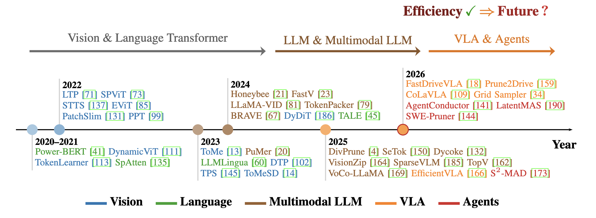

# ⭐ Awesome Token Pruning / Compression / Reduction [](https://github.com/sindresorhus/awesome) [](https://docs.google.com/spreadsheets/d/1tZvQEwK8y3fXRufEsz3VOcUcyBzexTj-x7WLLGIzIMg/edit?usp=sharing) [](https://arxiv.org/abs/2505.18227v4)


📚 This repository contains a list of recent papers on token reduction (**token pruning, merging, clustering, compressing, adaptive thinking** etc.) for ML/Gen AI; we categorize them based on their year and application scenarios. 

👀 If you found any **errors** or **missing papers**, please don't hesitate to **open an issue** or **pull request**. We invite your participation in advancing this field.

<p align="center">  </p>

## 📜 Citation
If you find our work useful for your project, please consider citing our paper and starring this repo.
```
@article{kong2025token,
  title={Token Reduction Should Go Beyond Efficiency in Generative Models--From Vision, Language to Multimodality},
  author={Kong, Zhenglun and Li, Yize and Zeng, Fanhu and Xin, Lei and Messica, Shvat and Lin, Xue and Zhao, Pu and Kellis, Manolis and Tang, Hao and Zitnik, Marinka},
  journal={arXiv preprint arXiv:2505.18227},
  year={2026}
}
```

## 📢 News
- **`2026/08/26`** Added EMNLP 2026, IJCAI 2026, ACM MM 2026, ECCV 2026, ICML 2026, ACL 2026, CVPR 2026, ICLR 2026, ICRA 2026, AAAI 2026, WACV 2026, ICASSP 2026, 3DV 2026, TMLR 2026.
- **`2026/01/12`** 🔥🔥 Added new section 🤖***Agentic Systems***.
- **`2026/01/12`** 🔥🔥 Update paper "[Token Reduction Should Go Beyond Efficiency in Generative Models -- From Vision, Language to Multimodality](https://arxiv.org/pdf/2505.18227v4)": ***Add Agent, Efficient Reasoning, VLA and more reference works***.
- **`2025/05/25`** Checkout our newly released **position** paper "[Token Reduction Should Go Beyond Efficiency in Generative Models -- From Vision, Language to Multimodality](https://arxiv.org/abs/2505.18227)", which demonstrates how token reduction is leveraged for **more than just efficiency gains**, and outlines key future directions.
- **`2025 Conference`** NeurIPS 2025, CVPR 2025, ICLR 2025, ICML 2025, ICCV 2025, WACV 2025, AAAI 2025, ACL 2025, EMNLP 2025, COLING 2025, COLM 2025, NAACL 2025, ICASSP 2025, ACM MM 2025, ICME 2025.

## Table of Contents
A detailed list of papers organized by modality can be found in this [Google Sheet](https://docs.google.com/spreadsheets/d/1tZvQEwK8y3fXRufEsz3VOcUcyBzexTj-x7WLLGIzIMg/edit?usp=sharing), including a brief introduction of the **task, token reduction type, contribution, and methodology** for each paper.

- [🌁 Vision](#vision)
- [📝 Language](#language)
- [🎬 Vision-Language (Action) Model](#vision-language(action)-model)
- [🤖 Agentic Systems](#agent)
- [📱 Hardware Co-design](#hardware)
- [🐍 State Space Models](#states)

## 🌁 Vision 
<a id="vision"></a>
#### 2026
* [**IJCAI'26**] Joint Neural Architecture Search and Token Pruning for Efficient Visual Tracking [[Paper](https://ijcai-preprints.s3.us-west-1.amazonaws.com/2026/2992.pdf)] [[Code](https://github.com/Cyhoon84/NASTrack)]
* [**ICML'26**] Statistically Calibrated Scaling for Token Merging in Transformers [[Paper](https://crabwq.github.io/pdf/2026%20sqrt_ICML.pdf)]
* [**CVPR'26**] Revisiting Token Compression for Accelerating ViT-based Sparse Multi-View 3D Object Detectors [[Paper](https://arxiv.org/pdf/2604.14563)] [[Code](https://github.com/Mingqj/SEPatch3D)]
* [**CVPR'26**] TokenHand: Discrete Token Representation for Efficient Hand Mesh Reconstruction [[Paper](https://openaccess.thecvf.com/content/CVPR2026/papers/He_TokenHand_Discrete_Token_Representation_for_Efficient_Hand_Mesh_Reconstruction_CVPR_2026_paper.pdf)] 
* [**CVPR'26**] SToRe3D: Sparse Token Relevance in ViTs for Efficient Multi-View 3D Object Detection [[Paper](https://arxiv.org/pdf/2605.14110)] 
* [**CVPR'26**] SceneTok: A Compressed, Diffusable Token Space for 3D Scenes [[Paper](https://arxiv.org/pdf/2602.18882)] [[Code](https://github.com/mohammadasim98/scenetok)]
* [**CVPR'26**] Adaptive Depth Lightweight RGB-T Tracking with Holistic Token Routing [[Paper](https://openaccess.thecvf.com/content/CVPR2026/papers/Ding_Adaptive_Depth_Lightweight_RGB-T_Tracking_with_Holistic_Token_Routing_CVPR_2026_paper.pdf)] 
* [**CVPR'26**] LazyVAR: Accelerating Visual Autoregressive Models via Scale-wise Token Pruning and Parallel Group Decoding [[Paper](https://openaccess.thecvf.com/content/CVPR2026/papers/Mao_LazyVAR_Accelerating_Visual_Autoregressive_Models_via_Scale-wise_Token_Pruning_and_CVPR_2026_paper.pdf)] 
* [**CVPR'26**] Guiding Token-Sparse Diffusion Models [[Paper](https://openaccess.thecvf.com/content/CVPR2026/papers/Krause_Guiding_Token-Sparse_Diffusion_Models_CVPR_2026_paper.pdf)] [[Code](https://github.com/CompVis/tread)]
* [**CVPR'26**] Saliency-Driven Token Merging for Vision Transformers [[Paper](https://openaccess.thecvf.com/content/CVPR2026/papers/Xie_Saliency-Driven_Token_Merging_for_Vision_Transformers_CVPR_2026_paper.pdf)]
* [**CVPR'26**] LiteVGGT: Boosting Vanilla VGGT via Geometry-aware Cached Token Merging [[Paper](https://arxiv.org/pdf/2512.04939)] [[Code](https://github.com/GarlicBa/LiteVGGT-repo)]
* [**CVPR'26**] HTTM: Head-wise Temporal Token Merging for Faster VGGT [[Paper](https://openaccess.thecvf.com/content/CVPR2026/papers/Wang_HTTM_Head-wise_Temporal_Token_Merging_for_Faster_VGGT_CVPR_2026_paper.pdf)]
* [**CVPR'26**] Dyna-ViT: Parameter-Free Pre-Encoder Token Pruning for Efficient Vision Transformers [[Paper](https://openaccess.thecvf.com/content/CVPR2026F/papers/Rubab_Dyna-ViT_Parameter-Free_Pre-Encoder_Token_Pruning_for_Efficient_Vision_Transformers_CVPRF_2026_paper.pdf)]
* [**CVPR'26**] MaMe: Matrix-Based Token Merging [[Paper](https://openaccess.thecvf.com/content/CVPR2026F/papers/Huo_MaMe_Matrix-Based_Token_Merging_CVPRF_2026_paper.pdf)] [[Code](https://github.com/cominder/mame)]
* [**CVPR'26**] SPOT: Sparsification with Attention Dynamics via Token Relevance in Vision Transformers [[Paper](https://openaccess.thecvf.com/content/CVPR2026F/papers/Schlesinger_SPOT_Sparsification_with_Attention_Dynamics_via_Token_Relevance_in_Vision_CVPRF_2026_paper.pdf)] [[Code](https://github.com/odedsc/SPOT)]
* [**CVPR'26**] A Frame is Worth One Token: Efficient Generative World Modeling with Delta Tokens [[Paper](https://arxiv.org/pdf/2604.04913)] [[Code](https://github.com/amazon-far/deltatok)]
* [**CVPR'26**] An Efficient Token Compression Framework for Visual Object Tracking [[Paper](https://arxiv.org/pdf/2605.08329)] [[Code](https://github.com/PJD-WJ/ETCTrack)]
* [**CVPR'26**] Co-Me: Confidence Guided Token Merging for Visual Geometric Transformers [[Paper](https://arxiv.org/pdf/2511.14751)] [[Code](https://github.com/co-me-tokens/CoMe)]
* [**CVPR'26**] From Pixels to Privacy: Temporally Consistent Video Anonymization via Token Pruning for Privacy Preserving Action Recognition [[Paper](https://arxiv.org/pdf/2603.26336)] [[Code](https://github.com/Rabusi/From-Pixels-to-Privacy-Temporally-Consistent-Video-Anonymization-via-Token-Pruning-for-Privacy-Pres)]
* [**CVPR'26**] BiGain: Unified Token Compression for Joint Generation and Classification [[Paper](https://arxiv.org/pdf/2603.12240)] [[Code](https://github.com/Greenoso/BiGain)]
* [**CVPR'26**] OminiControl2: Efficient Conditioning for Diffusion Transformers [[Paper](https://arxiv.org/pdf/2503.08280)] [[Code](https://github.com/Yuanshi9815/OminiControl)]
* [**CVPR'26**] SpotEdit: Selective Region Editing in Diffusion Transformers [[Paper](https://arxiv.org/pdf/2512.22323)] [[Code](https://github.com/Biangbiang0321/SpotEdit)]
* [**CVPR'26**] UTPTrack: Towards Simple and Unified Token Pruning for Visual Tracking [[Paper](https://arxiv.org/pdf/2602.23734)] [[Code](https://github.com/EIT-NLP/UTPTrack)]
* [**ICLR'26**] InfoTok: Adaptive Discrete Video Tokenizer via Information-Theoretic Compression [[Paper](https://arxiv.org/pdf/2512.16975)] [[Code](https://github.com/YWolfeee/InfoTok)]
* [**ICLR'26**] RegionE: Adaptive Region-Aware Generation for Efficient Image Editing [[Paper](https://arxiv.org/pdf/2510.25590)] [[Code](https://github.com/Peyton-Chen/RegionE)]
* [**ICASSP'26**] TINYDROP: TINY MODEL GUIDED TOKEN DROPPING FOR VISION TRANSFORMERS [[Paper](https://arxiv.org/pdf/2509.03379)]
* [**AAAI'26**] V-Pruner: A Fast and Globally-informed Token Pruning Framework for Vision Transformer [[Paper](https://ojs.aaai.org/index.php/AAAI/article/download/40737/44698)] [[Code](https://github.com/Yaoguangzhen/V-Pruner)]
* [**AAAI'26**] CompTrack: Information Bottleneck-Guided Low-Rank Dynamic Token Compression for Point Cloud Tracking [[Paper](https://arxiv.org/pdf/2511.15580)]
* [**3DV'26**] CTR3D: Cross-view Token Reduction for Dense Multi-view Generation [[Paper](https://openreview.net/pdf?id=3rJQj0xZJv)] [[Code](https://github.com/HKUST-SAIL/CTR3D)]
#### 2025
* [**ICML'25**] AsymRnR: Video Diffusion Transformers Acceleration with Asymmetric Reduction and Restoration [[Paper](https://arxiv.org/pdf/2412.11706)] [[Code](https://github.com/wenhao728/AsymRnR)]
* [**NeurIPS'25**] Frequency-Aware Token Reduction for Efficient Vision Transformer [[Paper](https://openreview.net/pdf?id=Dr06Wjh45k)] [[Code](https://github.com/jhtwosun/frequency-aware-token-pruning)]
* [**NeurIPS'25**] SparseDiT: Token Sparsification for Efficient Diffusion Transformer [[Paper](https://arxiv.org/abs/2412.06028)] [[Code](https://github.com/changsn/SparseDiT)]
* [**ICASSP'25**] Cross-Layer Cache Aggregation for Token Reduction in Ultra-Fine-Grained Image Recognition [[Paper](https://ieeexplore.ieee.org/document/10890489)] [[Code](https://github.com/arkel23/CLCA)]
* [**ICME'25**] Sparsedm: Toward sparse efficient diffusion models [[Paper](https://arxiv.org/pdf/2404.10445)]
* [**ICME'25**] SPEECHPRUNE: Context-aware Token Pruning for Speech Information Retrieval [[Paper](https://arxiv.org/pdf/2412.12009)]
* [**ICCV'25**] Keyframe-oriented Vision Token Pruning: Enhancing Efficiency of Large Vision Language Models on Long-Form Video Processing [[Paper](https://arxiv.org/pdf/2503.10742)]
* [**ICCV'25**] AuroraLong: Bringing RNNs Back to Efficient Open-Ended Video Understanding [[Paper](https://arxiv.org/pdf/2507.02591)]
* [**ICCV'25**] Representation Shift: Unifying Token Compression with FlashAttention [[Paper](https://openaccess.thecvf.com/content/ICCV2025/papers/Choi_Representation_Shift_Unifying_Token_Compression_with_FlashAttention_ICCV_2025_paper.pdf)] [[Code](https://github.com/mlvlab/Representation-Shift)]
* [**CVPR'25**] Layer-and Timestep-Adaptive Differentiable Token Compression Ratios for Efficient Diffusion Transformers [[Paper](https://arxiv.org/pdf/2412.16822)] [[Code](https://github.com/GATECH-EIC/DiffCR)]
* [**CVPR'25**] Faster Parameter-Efficient Tuning with Token Redundancy Reduction [[Paper](https://openaccess.thecvf.com/content/CVPR2025/papers/Kim_Faster_Parameter-Efficient_Tuning_with_Token_Redundancy_Reduction_CVPR_2025_paper.pdf)] [[Code](https://github.com/kyk120/fpet)]
* [**CVPR'25**] AdaCM<sup>2</sup>: On Understanding Extremely Long-Term Video with Adaptive Cross-Modality Memory Reduction [[Paper](https://arxiv.org/pdf/2411.12593v3)]
* [**CVPR'25**] Token Cropr: Faster ViTs for Quite a Few Tasks [[Paper](https://arxiv.org/pdf/2412.00965)]
* [**CVPR'25**] Attend to Not Attended: Structure-then-Detail Token Merging for Post-training DiT Acceleration [[Paper](https://arxiv.org/pdf/2505.11707)] [[Code](https://github.com/ICTMCG/SDTM)]
* [**CVPR'25**] MergeVQ: A Unified Framework for Visual Generation and Representation with Disentangled Token Merging and Quantization [[Paper](https://arxiv.org/pdf/2504.00999)] [[Code](https://apexgen-x.github.io/MergeVQ/)]
* [**CVPR'25**] Rethinking Token Reduction with Parameter-Efficient Fine-Tuning in ViT for Pixel-Level Tasks [[Paper](https://openaccess.thecvf.com/content/CVPR2025/papers/Lei_Rethinking_Token_Reduction_with_Parameter-Efficient_Fine-Tuning_in_ViT_for_Pixel-Level_CVPR_2025_paper.pdf)] [[Code](https://github.com/AVC2-UESTC/DAR-TR-PEFT)]
* [**CVPR'25**] CATANet: Efficient Content-Aware Token Aggregation for Lightweight Image Super-Resolution [[Paper](https://arxiv.org/abs/2503.06896)] [[Code](https://github.com/EquationWalker/CATANet)]
* [**CVPR'25**] VASparse: Towards Efficient Visual Hallucination Mitigation via Visual-Aware Token Sparsification [[Paper](https://arxiv.org/abs/2501.06553)] [[Code](https://github.com/mengchuang123/VASparse-github)]
* [**CVPR'25**] Faster Parameter-Efficient Tuning with Token Redundancy Reduction [[Paper](https://arxiv.org/abs/2503.20282)]
* [**ICLR'25**] Accelerating Diffusion Transformers with Token-wise Feature Caching [[Paper](https://arxiv.org/pdf/2410.05317)] [[Code](https://github.com/Shenyi-Z/ToCa)]
* [**ICLR'25**] AuroraCap: Efficient, Performant Video Detailed Captioning and a New Benchmark [[Paper](https://arxiv.org/pdf/2410.03051)] [[Code](https://github.com/rese1f/aurora)]
* [**ICLR'25**] Mutual Effort for Efficiency: A Similarity-based Token Pruning for Vision Transformers in Self-Supervised Learning [[Paper](https://openreview.net/pdf?id=GTcEe5fayC)]
* [**ICLR'25**] Dynamic diffusion transformer [[Paper](https://arxiv.org/pdf/2410.03456)] [[Code](https://github.com/NUS-HPC-AI-Lab/Dynamic-Diffusion-Transformer)]
* [**WACV'25**] Pruning One More Token is Enough: Leveraging Latency-Workload Non-Linearities for Vision Transformers on the Edge  [[Paper](https://arxiv.org/abs/2407.05941)]
* [**ICASSP'25**] Pruning then reweighting: Towards data-efficient training of diffusion models [[Paper](https://ieeexplore.ieee.org/abstract/document/10888554)] [[Code](https://github.com/Yeez-lee/Data-Selection-and-Reweighting-for-Diffusion-Models)]
* [**AAAI'25**] FreqTS: Frequency-Aware Token Selection for Accelerating Diffusion Models [[Paper](https://ojs.aaai.org/index.php/AAAI/article/view/33008)]
* [**AAAI'25**] Multimodal Promptable Token Merging for Diffusion Models [[Paper](https://ojs.aaai.org/index.php/AAAI/article/view/33894)]
* [**AAAI'25**] Training-free and hardware-friendly acceleration for diffusion models via similarity-based token pruning [[Paper](https://ojs.aaai.org/index.php/AAAI/article/view/33071)] [[Code](https://github.com/EvelynZhang-epiclab/SiTo)]
* [arXiv] Pretraining Frame Preservation in Autoregressive Video Memory Compression [[Paper](https://arxiv.org/pdf/2512.23851)] [[Code](https://github.com/lllyasviel/PFP)]
* [arXiv] Token Transforming: A Unified and Training-Free Token Compression Framework for Vision Transformer Acceleration [[Paper](https://arxiv.org/abs/2506.05709)] [[Code](https://github.com/AuroraZengfh/TokenTransforming)]
* [arXiv] Pyramid Sparse Transformer: Efficient Multi-Scale Feature Fusion with Dynamic Token Selection [[Paper](https://arxiv.org/pdf/2505.12772)] [[Code](https://github.com/inlmouse/PyramidSparseTransformer)]
* [arXiv] Cached Adaptive Token Merging: Dynamic Token Reduction and Redundant Computation Elimination in Diffusion Model [[Paper](https://arxiv.org/pdf/2501.00946)] [[Code](https://github.com/omidiu/ca_tome)]
* [arXiv] UniCP: A Unified Caching and Pruning Framework for Efficient Video Generation [[Paper](https://arxiv.org/pdf/2502.04393)]
* [arXiv] CAT Pruning: Cluster-Aware Token Pruning For Text-to-Image Diffusion Models [[Paper](https://arxiv.org/pdf/2502.00433)] [[Code](https://github.com/ada-cheng/CAT-Pruning)]
* [arXiv] Concise Reasoning, Big Gains: Pruning Long Reasoning Trace with Difficulty-Aware Prompting [[Paper](https://arxiv.org/pdf/2505.19716)] [[Code](https://github.com/Evanwu1125/LiteCoT)]

#### 2024
* [**NeurIPS'24**] Accelerating Transformers with Spectrum-Preserving Token Merging [[Paper](https://arxiv.org/pdf/2405.16148)]
* [**NeurIPS'24**] Video Token Merging for Long Video Understanding [[Paper](https://arxiv.org/pdf/2410.23782)]
* [**NeurIPS'24**] Don't Look Twice: Faster Video Transformers with Run-Length Tokenization [[Paper](https://arxiv.org/pdf/2411.05222)] [[Code](https://github.com/rccchoudhury/rlt)]
* [**NeurIPSW'24**] M2M-TAG: Training-Free Many-to-Many Token Aggregation for Vision Transformer Acceleration [[Paper](openreview.net/forum?id=LO3Mw8Jrk0)] [[Code](https://github.com/AuroraZengfh/TokenTransforming)]
* [**ECCV'24**] Agglomerative Token Clustering [[Paper](https://arxiv.org/pdf/2409.11923)] [[Code](https://github.com/JoakimHaurum/ATC)] 
* [**ECCV'24**] Token Compensator: Altering Inference Cost of Vision Transformer without Re-Tuning [[Paper](https://arxiv.org/pdf/2408.06798)] [[Code](https://github.com/JieShibo/ToCom)]
* [**ECCV'24**] LookupViT: Compressing visual information to a limited number of tokens [[Paper](https://arxiv.org/pdf/2407.12753)]
* [**ECCV'24**] PYRA: Parallel Yielding Re-Activation for Training-Inference Efficient Task Adaptation [[Paper](https://arxiv.org/abs/2403.09192)] [[Code](https://github.com/THU-MIG/PYRA?tab=readme-ov-file)]
* [**ECCV'24**] Turbo: Informativity-driven acceleration plug-in for vision-language large models [[Paper](https://link.springer.com/chapter/10.1007/978-3-031-72952-2_25)]
* [**ECCV'24**] Object-centric diffusion for efficient video editing [[Paper](https://arxiv.org/pdf/2401.05735)]
* [**ECCV'24**] Leveraging temporal contextualization for video action recognition [[Paper](https://arxiv.org/pdf/2404.09490)] [[Code](https://github.com/naver-ai/tc-clip)]
* [**IJCAI'24**] ToDo: token downsampling for efficient generation of high-resolution images [[Paper](https://www.ijcai.org/proceedings/2024/1036.pdf)]
* [**CVPR'24**] Attention-driven training-free efficiency enhancement of diffusion models [[Paper](https://arxiv.org/pdf/2405.05252)]
* [**CVPR'24**] vid-TLDR: Training Free Token Merging for Light-weight Video Transformer [[Paper](https://openaccess.thecvf.com/content/CVPR2024/papers/Choi_vid-TLDR_Training_Free_Token_Merging_for_Light-weight_Video_Transformer_CVPR_2024_paper.pdf)] [[Code](https://github.com/mlvlab/vid-TLDR)]
* [**CVPR'24**] Vidtome: Video token merging for zero-shot video editing [[Paper](https://arxiv.org/pdf/2312.10656)] [[Code](https://github.com/VISION-SJTU/VidToMe)]
* [**CVPR'24**] Zero-TPrune: Zero-Shot Token Pruning through Leveraging of the Attention Graph in Pre-Trained Transformers [[Paper](https://openaccess.thecvf.com/content/CVPR2024/papers/Wang_Zero-TPrune_Zero-Shot_Token_Pruning_through_Leveraging_of_the_Attention_Graph_CVPR_2024_paper.pdf)] [[Code](https://jha-lab.github.io/zerotprune/)] 
* [**ICLR'24**] Synergistic Patch Pruning for Vision Transformer: Unifying Intra- & Inter-Layer Patch Importance [[Paper](https://openreview.net/pdf?id=COO51g41Q4)]
* [**WACV'24**] Token Fusion: Bridging the Gap Between Token Pruning and Token Merging [[Paper](https://openaccess.thecvf.com/content/WACV2024/papers/Kim_Token_Fusion_Bridging_the_Gap_Between_Token_Pruning_and_Token_WACV_2024_paper.pdf)]
* [**WACV'24**] Revisiting Token Pruning for Object Detection and Instance Segmentation [[Paper](https://openaccess.thecvf.com/content/WACV2024/papers/Liu_Revisiting_Token_Pruning_for_Object_Detection_and_Instance_Segmentation_WACV_2024_paper.pdf)] [[Code](https://github.com/uzh-rpg/svit/)]
* [arXiv] Token Pruning for Caching Better: 9 Times Acceleration on Stable Diffusion for Free [[Paper](https://arxiv.org/pdf/2501.00375)] 
* [arXiv] Vote&Mix: Plug-and-Play Token Reduction for Efficient Vision Transformer [[Paper](https://arxiv.org/pdf/2408.17062)] 
* [arXiv] Dynamic and Compressive Adaptation of Transformers From Images to Videos [[Paper](https://arxiv.org/pdf/2408.06840)]
* [arXiv] Importance-based Token Merging for Diffusion Models [[Paper](https://arxiv.org/pdf/2411.16720)]
* [arXiv] Token Caching for Diffusion Transformer Acceleration [[Paper](https://arxiv.org/pdf/2409.18523)]
* [arXiv] FlexDiT: Dynamic Token Density Control for Diffusion Transformer [[Paper](https://arxiv.org/pdf/2412.06028)] [[Code](https://github.com/changsn/FlexDiT)]
* [arXiv] Principles of Visual Tokens for Efficient Video Understanding [[Paper](https://arxiv.org/pdf/2411.13626)] 

#### 2023
* [**EMNLP'23**] TESTA: Temporal-Spatial Token Aggregation for Long-form Video-Language Understanding [[Paper](https://arxiv.org/pdf/2310.19060)] [[Code](https://github.com/RenShuhuai-Andy/TESTA)]
* [**ICCV'23**] Dynamic Token Pruning in Plain Vision Transformers for Semantic Segmentation [[Paper](https://openaccess.thecvf.com/content/ICCV2023/papers/Tang_Dynamic_Token_Pruning_in_Plain_Vision_Transformers_for_Semantic_Segmentation_ICCV_2023_paper.pdf)] [[Code](https://github.com/zbwxp/Dynamic-Token-Pruning)]
* [**ICCV'23**] DiffRate: Differentiable Compression Rate for Efficient Vision Transformers [[Paper](https://arxiv.org/abs/2305.17997)] [[Code](https://github.com/OpenGVLab/DiffRate)]
* [**ICCV'23**] TORE: Token Reduction for Efficient Human Mesh Recovery with Transformer [[Paper](https://openaccess.thecvf.com/content/ICCV2023/papers/Dou_TORE_Token_Reduction_for_Efficient_Human_Mesh_Recovery_with_Transformer_ICCV_2023_paper.pdf)] [[Code](https://github.com/Frank-ZY-Dou/TORE)]
* [**ICCV'23**] Prune spatio-temporal tokens by semantic-aware temporal accumulation [[Paper](https://arxiv.org/pdf/2308.04549)] [[Code](https://github.com/Mark12Ding/STA)]
* [**ICCV'23**] Efficient Video Action Detection with Token Dropout and Context Refinement [[Paper](https://arxiv.org/pdf/2304.08451)] [[Code](https://github.com/MCG-NJU/EVAD)]
* [**ICCV'23**] Masked Diffusion Transformer is a Strong Image Synthesizer [[Paper](https://arxiv.org/pdf/2303.14389v2)] [[Code](https://github.com/sail-sg/MDT)]
* [**ICCV'23** Workshop] Which Tokens to Use? Investigating Token Reduction in Vision Transformers [[Paper](https://arxiv.org/abs/2308.04657)] [[Code](https://github.com/JoakimHaurum/TokenReduction)] 
* [**CVPR'23**] Joint Token Pruning and Squeezing Towards More Aggressive Compression of Vision Transformers [[Paper](https://arxiv.org/pdf/2304.10716)] [[Code](https://github.com/megvii-research/TPS-CVPR2023)]
* [**CVPRW'23**] Token merging for fast stable diffusion [[Paper](https://openaccess.thecvf.com/content/CVPR2023W/ECV/papers/Bolya_Token_Merging_for_Fast_Stable_Diffusion_CVPRW_2023_paper.pdf)] [[Code](https://github.com/dbolya/tomesd)]
* [**ICLR'23**] Token Merging: Your ViT But Faster [[Paper](https://arxiv.org/pdf/2210.09461)] [[Code](https://github.com/facebookresearch/ToMe)]
* [**IJCAI'23**] Adaptive Sparse ViT: Towards Learnable Adaptive Token Pruning by Fully Exploiting Self-Attention [[Paper](https://arxiv.org/pdf/2209.13802)] [[Code](https://github.com/Cydia2018/AS-ViT)]
* [**TIP**] Efficient Vision Transformer via Token Merger [[Paper](https://ieeexplore.ieee.org/stamp/stamp.jsp?tp=&arnumber=10183862)]
* [arXiv] PPT: Token Pruning and Pooling for Efficient Vision Transformers [[Paper](https://arxiv.org/pdf/2310.01812)] [[Code](https://github.com/xjwu1024/PPT)]

#### 2022
* [**ECCV'22**] SPViT: Enabling Faster Vision Transformers via Latency-aware Soft Token Pruning [[Paper](https://www.ecva.net/papers/eccv_2022/papers_ECCV/papers/136710618.pdf)] [[Code](https://github.com/PeiyanFlying/SPViT)] 
* [**ECCV'22**] ATS: Adaptive Token Sampling For Efficient Vision Transformers [[Paper](https://arxiv.org/abs/2111.15667)] [[Code](https://github.com/adaptivetokensampling/ATS)]
* [**ECCV'22**] PPT: token-Pruned Pose Transformer for monocular and multi-view human pose estimation [[Paper](https://arxiv.org/pdf/2209.08194)] [[Code](https://github.com/HowieMa/PPT)]
* [**ECCV'22**] Ts2-net: Token shift and selection transformer for text-video retrieval [[Paper](https://arxiv.org/pdf/2207.07852)]
* [**ECCV'22**] Efficient video transformers with spatial-temporal token selection [[Paper](https://arxiv.org/pdf/2111.11591)] [[Code](https://github.com/wdrink/STTS)]
* [**CVPR'22**] Vision Transformer Slimming: Multi-Dimension Searching in Continuous Optimization Space [[Paper](https://arxiv.org/pdf/2201.00814)] [[Code](https://github.com/Arnav0400/ViT-Slim)]
* [**CVPR'22**] Patch Slimming for Efficient Vision Transformers [[Paper](https://arxiv.org/abs/2106.02852)]
* [**CVPR'22**] A-ViT: Adaptive Tokens for Efficient Vision Transformer [[Paper](https://arxiv.org/pdf/2112.07658)] [[Code](https://github.com/NVlabs/A-ViT)]
* [**ICLR'22**] EViT: Expediting Vision Transformers via Token Reorganizations [[Paper](https://arxiv.org/pdf/2202.07800)] [[Code](https://github.com/youweiliang/evit?tab=readme-ov-file)]
* [**AAAI'22**] Evo-ViT: Slow-Fast Token Evolution for Dynamic Vision Transformer [[Paper](https://arxiv.org/abs/2108.01390)] [[Code](https://github.com/YifanXu74/Evo-ViT)]

#### 2021
* [**NeurIPS'21**] IA-RED2: Interpretability-Aware Redundancy Reduction for Vision Transformers [[Paper](https://arxiv.org/pdf/2106.12620)]
* [**NeurIPS'21**] Tokenlearner: Adaptive space-time tokenization for videos [[Paper](https://proceedings.neurips.cc/paper_files/paper/2021/file/6a30e32e56fce5cf381895dfe6ca7b6f-Paper.pdf)] [[Code](https://github.com/google-research/scenic/tree/main/scenic/projects/token_learner)]
* [**NeurIPS'21**] DynamicViT: Efficient Vision Transformers with Dynamic Token Sparsification [[Paper](https://arxiv.org/abs/2106.02034)] [[Code](https://github.com/raoyongming/DynamicViT)]


## 📝 Language 
<a id="language"></a>
#### 2026
* [**EMNLP'26**] HybridThinker: Efficient Chain-of-Thought Reasoning via Compressed Memory and Transient Thought Steps [[Paper](https://arxiv.org/pdf/2606.03768)]
* [**IJCAI'26**] Adaptive GoGI-Skip: Coupling Goal-Gradient Importance with Dynamic Uncertainty for Efficient Reasoning [[Paper](https://ijcai-preprints.s3.us-west-1.amazonaws.com/2026/3204.pdf)]
* [**IJCAI'26**] Sprint or Delve: A Distribution-Aware Approach to Efficient Reasoning [[Paper](https://ijcai-preprints.s3.us-west-1.amazonaws.com/2026/2631.pdf)]
* [**IJCAI'26**] TS-PEFT: Unveiling Token-Level Redundancy in Parameter-Efficient Fine-Tuning [[Paper](https://ijcai-preprints.s3.us-west-1.amazonaws.com/2026/1673.pdf)]
* [**ICML'26**] When Simple Problems Wear Complex Costumes: Improving Efficiency in LRM's Adaptive Reasoning [[Paper](https://openreview.net/pdf?id=df9S9BaN8T)]
* [**ICML'26**] MixReasoning: Switching Modes to Think [[Paper](https://arxiv.org/pdf/2510.06052)] [[Code](https://github.com/haiquanlu/MixReasoning)] 
* [**ICML'26**] ThreadWeaver: Adaptive Threading for Efficient Parallel Reasoning in Language Models [[Paper](https://openreview.net/attachment?id=Efq2VvYk1o&name=pdf)]
* [**ICML'26**] Less Is More: Elevating RAG via Performance-Driven Context Compression [[Paper](https://arxiv.org/pdf/2508.19282)] [[Code](https://github.com/ziqiangcui/CORE-RAG-ICML26)] 
* [**ICML'26**] Latent Thoughts Tuning: Bridging Context and Reasoning with Fused Information in Latent Tokens [[Paper](https://openreview.net/pdf?id=SFTFsixO2K)] [[Code](https://github.com/NeosKnight233/Latent-Thoughts-Tuning)] 
* [**ICML'26**] Training-Trajectory-Aware Token Selection [[Paper](https://openreview.net/pdf?id=G6PSKuGEEe)] 
* [**ICML'26**] ConceptMoE: Adaptive Token-to-Concept Compression for Implicit Compute Allocation [[Paper](https://openreview.net/pdf/1c350d87d460911430f55c974838111ee5a541fc.pdf)] [[Code](https://github.com/ZihaoHuang-notabot/ConceptMoE)]
* [**ICML'26**] Dynamic Thinking-Token Selection for Efficient Reasoning in Large Reasoning Models [[Paper](https://arxiv.org/pdf/2601.18383)] [[Code](https://github.com/Robin930/DynTS)]
* [**ICML'26**] ImgCoT: Compressing Long Chain of Thought into Compact Visual Tokens for Efficient Reasoning of Large Language Model [[Paper](https://openreview.net/pdf?id=UM6ifyC63p)]
* [**ICML'26**] ThoughtFold: Folding Reasoning Chains via Introspective Preference Learning [[Paper](https://arxiv.org/pdf/2606.03503)] [[Code](https://github.com/ziyanliux/ThoughtFold)]
* [**ICML'26**] Efficient Reasoning with Hidden Thinking [[Paper](https://arxiv.org/pdf/2501.19201)] [[Code](https://github.com/shawnricecake/Heima)]
* [**ACL'26**] Your Reasoning Model Knows What Counts: Self-Guided Chain-of-Thought Pruning for Efficient Reasoning [[Paper](https://aclanthology.org/2026.acl-long.25.pdf)] [[Code](https://github.com/HammerScholar/SGP-CoT)]
* [**ACL'26**] Think How to Think: Mitigating Overthinking with Autonomous Difficulty Cognition in Large Reasoning Models [[Paper](https://aclanthology.org/2026.acl-long.1766.pdf)]
* [**ACL'26**] TL;DR: Too Long, Do Re-weighting for Effcient LLM Reasoning Compression [[Paper](https://aclanthology.org/2026.acl-long.1856.pdf)] [[Code](https://github.com/zzli2022/TLDR)]
* [**ACL'26**] CLARO: Controlled Attribute-Driven Reasoning Optimization for Efficient Chain-of-Thought [[Paper](https://aclanthology.org/2026.findings-acl.1335.pdf)] [[Code](https://github.com/odedsc/CLARO)]
* [**ACL'26**] Thinking with Reasoning Skills: Fewer Tokens, More Accuracy [[Paper](https://aclanthology.org/2026.acl-industry.154.pdf)] [[Code](https://github.com/stallone0000/Reasoning-Skill)]
* [**ACL'26**] Less Languages, Less Tokens: An Efficient Unified Logic Cross-lingual Chain-of-Thought Reasoning Framework [[Paper](https://aclanthology.org/2026.acl-long.1379.pdf)]
* [**ACL'26**] EQUIP: EQUivariant preserving In-Place updates for Efficient token-pruning [[Paper](https://aclanthology.org/2026.acl-long.1210.pdf)]
* [**ACL'26**] Not All Tokens Matter: Towards Efficient LLM Reasoning via Token Significance in Reinforcement Learning [[Paper](https://aclanthology.org/2026.acl-long.726.pdf)] [[Code](https://github.com/microsoft/Bingo)]
* [**ACL'26**] Reason Only When Needed: Efficient Generative Reward Modeling via Model-Internal Uncertainty [[Paper](https://arxiv.org/pdf/2604.10072)] 
* [**ACL'26**] StructMem: Structured Memory for Long-Horizon Behavior in LLMs [[Paper](https://arxiv.org/pdf/2604.21748)] [[Code](https://github.com/zjunlp/LightMem)]
* [**ACL'26**] ProFit: Leveraging High-Value Signals in SFT via Probability-Guided Token Selection [[Paper](https://arxiv.org/pdf/2601.09195)] [[Code](https://github.com/Utaotao/ProFit)]
* [**ACL'26**] Reinforced Efficient Reasoning via Semantically Diverse Exploration [[Paper](https://arxiv.org/pdf/2601.05053)] [[Code](https://github.com/ZiqiZhao1/ROSE-rl)]
* [**ACL'26**] Less is More: Improving LLM Reasoning with Minimal Test-Time Intervention [[Paper](https://arxiv.org/pdf/2510.13940)] [[Code](https://github.com/EnVision-Research/MTI)]
* [**ACL'26**] Revisiting Model Interpolation for Efficient Reasoning [[Paper](https://arxiv.org/pdf/2510.10977)] [[Code](https://github.com/wutaiqiang/MI)]
* [**ICLR'26**] DeepCompress: A Dual Reward Strategy for Dynamically Exploring and Compressing Reasoning Chains [[Paper](https://arxiv.org/pdf/2510.27419)] [[Code](https://github.com/Skytliang/DeepCompress)]
* [**ICLR'26**] Adaptive Thinking: Large Language Models Know When to Think in Latent Space [[Paper](https://openreview.net/pdf?id=2i6Rp0gCq6)] 
* [**ICLR'26**] SwiReasoning: Switch-Thinking in Latent and Explicit for Pareto-Superior Reasoning LLMs [[Paper](https://arxiv.org/pdf/2510.05069)] [[Code](https://github.com/sdc17/SwiReasoning)]
* [**ICLR'26**] Uni-cot: Towards Unified Chain-of-Thought Reasoning Across Text and Vision [[Paper](https://arxiv.org/pdf/2508.05606v2)] [[Code](https://github.com/Fr0zenCrane/UniCoT)]
* [**ICLR'26**] Efficient Reasoning with Balanced Thinking [[Paper](https://openreview.net/pdf?id=cJseWJJ5IM)] [[Code](https://github.com/yu-lin-li/ReBalance)]
* [**ICLR'26**] COMI: Coarse-to-fine Context Compression via Marginal Information Gain [[Paper](https://arxiv.org/pdf/2602.01719)] [[Code](https://github.com/Twilightaaa/COMI)]
* [**ICLR'26**] Plan and Budget: Effective and Efficient Test-Time Scaling on Reasoning Large Language Models [[Paper](https://arxiv.org/pdf/2505.16122)] [[Code](https://github.com/junhongmit/P-and-B)]
* [**ICLR'26**] DiffAdapt: Difficulty-Adaptive Reasoning for Token-Efficient LLM Inference [[Paper](https://arxiv.org/pdf/2510.19669)]
* [**ICLR'26**] LightMem: Lightweight and Efficient Memory-Augmented Generation [[Paper](https://arxiv.org/pdf/2510.18866)] [[Code](https://github.com/zjunlp/LightMem)]
* [**ICLR'26**] Self-Aligned Reward: Towards Effective and Efficient Reasoners [[Paper](https://arxiv.org/pdf/2509.05489)] [[Code](https://github.com/amazon-science/Self-Aligned-Reward-Towards_Effective_and_Efficient_Reasoners)]
* [**AAAI'26**] HAPO: Training Language Models to Reason Concisely via History-Aware Policy Optimization [[Paper](https://arxiv.org/pdf/2505.11225)] [[Code](https://github.com/HCY123902/HAPO)]
* [**AAAI'26**] SlimInfer: Accelerating Long-Context LLM Inference via Dynamic Token Pruning [[Paper](https://arxiv.org/pdf/2508.06447)] [[Code](https://github.com/Longxmas/SlimInfer)]
* [**AAAI'26**] CATS: Category-Aware Token-level Steering for Training-Free Redundancy Reduction in Large Reasoning Models [[Paper](https://ojs.aaai.org/index.php/AAAI/article/view/40778/44739)] [[Code](https://github.com/Zmfei/CATS)]
* [**AAAI'26**] Efficient Reasoning for Large Reasoning Language Models via Certainty-Guided Reflection Suppression [[Paper](https://arxiv.org/pdf/2508.05337)]
* [**ICASSP'26**] Mask-GCG: Are All Tokens in Adversarial Suffixes Necessary for Jailbreak Attacks? [[Paper](https://arxiv.org/pdf/2509.06350)] [[Code](https://github.com/Junjie-Mu/Mask-GCG)]
* [**TMLR'26**] ThinkPrune: Pruning Long Chain-of-Thought of LLMs via Reinforcement Learning [[Paper](https://arxiv.org/pdf/2504.01296)] [[Code](https://github.com/UCSB-NLP-Chang/ThinkPrune)]
* [arXiv] Neural Chain-of-Thought Search: Searching the Optimal Reasoning Path to Enhance Large Language Models [[Paper](https://arxiv.org/pdf/2601.11340)] [[Code](https://github.com/MilkThink-Lab/Neural-CoT-Search)]
* [arXiv] Do LLMs Encode Functional Importance of Reasoning Tokens? [[Paper](https://arxiv.org/pdf/2601.03066)] [[Code](https://github.com/greedy-token-pruner/greedy-token-pruner/)]
* [arXiv] Self-Distilled Reasoner: On-Policy Self-Distillation for Large Language Models [[Paper](https://arxiv.org/pdf/2601.18734)]
#### 2025
* [arXiv] When Reasoning Meets Its Laws [[Paper](https://arxiv.org/pdf/2512.17901)] [[Code](https://github.com/ASTRAL-Group/LoRe)]
* [arXiv] Sparse-dLLM: Accelerating Diffusion LLMs with Dynamic Cache Eviction [[Paper](https://arxiv.org/pdf/2508.02558)] [[Code](https://github.com/OpenMOSS/Sparse-dLLM)]
* [arXiv] PaCoRe: Learning to Scale Test-Time Compute with Parallel Coordinated Reasoning [[Paper](https://github.com/stepfun-ai/PaCoRe/blob/main/pacore_report.pdf)] [[Code](https://github.com/stepfun-ai/PaCoRe/tree/main)]
* [arXiv] ARM2: Adaptive Reasoning Model with Vision Understanding and Executable Code [[Paper](https://arxiv.org/pdf/2510.08163)]
* [arXiv] AdaCoT: Pareto-Optimal Adaptive Chain-of-Thought Triggering via Reinforcement Learning [[Paper](https://arxiv.org/pdf/2505.11896)]
* [arXiv] Qwen3 Technical Report [[Paper](https://arxiv.org/pdf/2505.09388)] [[Code](https://github.com/QwenLM/Qwen3)]
* [**NAACL'25**] Perception Compressor: A Training-Free Prompt Compression Framework in Long Context Scenarios [[Paper](https://arxiv.org/pdf/2409.19272)] [[Code](https://github.com/Twilightaaa/PerceptionCompressor)]
* [**COLM'25**] SEAL: Steerable Reasoning Calibration of Large Language Models for Free [[Paper](https://arxiv.org/pdf/2504.07986)] [[Code](https://github.com/VITA-Group/SEAL)]
* [**EMNLP'25**] From Long to Lean: Performance-aware and Adaptive Chain-of-Thought Compression via Multi-round Refinement [[Paper](https://aclanthology.org/2025.emnlp-main.618.pdf)] [[Code](https://github.com/Leon221220/MACC)]
* [**EMNLP'25**] MuTIS: Enhancing Reasoning Efficiency through Multi-Turn Intervention Sampling in Reinforcement Learning [[Paper](https://aclanthology.org/2025.emnlp-main.690.pdf)] [[Code](https://github.com/Edric-Zhao/MuTIS)]
* [**EMNLP'25**] AdaptThink: LLM Can Learn When to Think [[Paper](https://arxiv.org/pdf/2505.13417)] [[Code](https://github.com/THU-KEG/AdaptThink)]
* [**EMNLP'25**] Position IDs Matter: An Enhanced Position Layout for Efficient Context Compression in Large Language Models [[Paper](https://aclanthology.org/2025.findings-emnlp.962.pdf)] [[Code](https://github.com/1azybug/EPL)]
* [**EMNLP'25**] ThinkSwitcher: When to Think Hard, When to Think Fast [[Paper](https://arxiv.org/pdf/2505.14183)]
* [**EMNLP'25**] TokenSkip: Controllable Chain-of-Thought Compression in LLMs [[Paper](https://arxiv.org/pdf/2502.12067)] [[Code](https://github.com/hemingkx/TokenSkip)]
* [**EMNLP'25**] TokenSelect: Efficient Long-Context Inference and Length Extrapolation for LLMs via Dynamic Token-Level KV Cache Selection [[Paper](https://arxiv.org/pdf/2411.02886)] [[Code](https://github.com/pzs19/TokenSelect)]
* [**EMNLP'25**] LightThinker: Thinking Step-by-Step Compression [[Paper](https://arxiv.org/pdf/2502.15589)] [[Code](https://github.com/zjunlp/LightThinker)]
* [**NeurIPSW'25**] Adaptive Dual Reasoner: Large Reasoning Models Can Think Efficiently by Hybrid Reasoning [[Paper](https://arxiv.org/pdf/2510.10207)]
* [**NeurIPSW'25**] The First Few Tokens Are All You Need: An Efficient and Effective Unsupervised Prefix Fine-Tuning Method for Reasoning Models [[Paper](https://proceedings.neurips.cc/paper_files/paper/2025/file/0d6da26625f780df1572cf7c8dc3faa6-Paper-Conference.pdf)] [[Code](https://github.com/1KE-JI/UPFT)]
* [**NeurIPSW'25**] Chopping Trees: Semantic Similarity Based Dynamic Pruning for Tree-of-Thought Reasoning [[Paper](https://arxiv.org/pdf/2511.00640)] [[Code](https://github.com/kimjoonghokim/SSDP)]
* [**NeurIPSW'25**] DTS: Enhancing Large Reasoning Models via Decoding Tree Sketching [[Paper](https://arxiv.org/pdf/2511.08595)] [[Code](https://github.com/ZichengXu/Decoding-Tree-Sketching)]
* [**NeurIPS'25**] When Less Language is More: Language-Reasoning Disentanglement Makes LLMs Better Multilingual Reasoners [[Paper](https://proceedings.neurips.cc/paper_files/paper/2025/file/372bd0e47f2d5bceca7e300e1446849c-Paper-Conference.pdf)] [[Code](https://github.com/MuyuenLP/Language-Reasoning-Disentangle)]
* [**NeurIPS'25**] Beyond the 80/20 Rule: High-Entropy Minority Tokens Drive Effective Reinforcement Learning for LLM Reasoning [[Paper](https://arxiv.org/pdf/2506.01939)] [[Code](https://github.com/Shenzhi-Wang/Beyond-the-80-20-Rule-RLVR)]
* [**NeurIPS'25**] VeriThinker: Learning to Verify Makes Reasoning Model Efficient [[Paper](https://openreview.net/pdf?id=Y1bt0YIS6Y)] [[Code](https://github.com/czg1225/VeriThinker)]
* [**NeurIPS'25**] Learning to Focus: Causal Attention Distillation via Gradient-Guided Token Pruning [[Paper](https://arxiv.org/pdf/2506.07851)] [[Code](https://github.com/RUCBM/LeaF)]
* [**NeurIPS'25**] Multi-head Temporal Latent Attention [[Paper](https://openreview.net/pdf?id=fm14gUThwh)] [[Code](https://github.com/D-Keqi/mtla)]
* [**NeurIPS'25**] Training Language Models to Reason Efficiently [[Paper](https://arxiv.org/pdf/2502.04463)] [[Code](https://github.com/Zanette-Labs/efficient-reasoning)]
* [**NeurIPS'25**] Flexible Realignment of Language Models [[Paper](https://arxiv.org/pdf/2506.12704)] [[Code](https://github.com/zwhong714/Realigner)]
* [**NeurIPS'25**] ARM: Adaptive Reasoning Model [[Paper](https://arxiv.org/pdf/2505.20258)] [[Code](https://github.com/TEAM-ARM/ARM)]
* [**NeurIPS'25**] Ada-R1: Hybrid-CoT via Bi-Level Adaptive Reasoning Optimization [[Paper](https://openreview.net/pdf?id=a9MfGUHjF8)] [[Code](https://github.com/StarDewXXX/AdaR1)]
* [**NeurIPS'25**] Soft Thinking: Unlocking the Reasoning Potential of LLMs in Continuous Concept Space [[Paper](https://openreview.net/pdf?id=ByQdHPGKgU)] [[Code](https://github.com/eric-ai-lab/Soft-Thinking)]
* [**NeurIPS'25**] Beyond the 80/20 Rule: High-Entropy Minority Tokens Drive Effective Reinforcement Learning for LLM Reasoning [[Paper](https://arxiv.org/pdf/2506.01939)] [[Code](https://github.com/Shenzhi-Wang/Beyond-the-80-20-Rule-RLVR)]
* [**NeurIPS'25**] Does Thinking More always Help? Mirage of Test-Time Scaling in Reasoning Models [[Paper](https://arxiv.org/pdf/2506.04210)]
* [**NeurIPS'25**] Thinkless: LLM Learns When to Think [[Paper](https://openreview.net/pdf?id=ariVQf0KZx)] [[Code](https://github.com/VainF/Thinkless)]
* [arXiv] GMSA: Enhancing Context Compression via Group Merging and Layer Semantic Alignment [[Paper](https://arxiv.org/pdf/2505.12215)]
* [arXiv] Beyond Fixed: Training-Free Variable-Length Denoising for Diffusion Large Language Models [[Paper](https://arxiv.org/pdf/2508.00819)] [[Code](https://github.com/Li-Jinsong/DAEDAL)]
* [arXiv] Optimizing Length Compression in Large Reasoning Models [[Paper](https://arxiv.org/pdf/2506.14755)] [[Code](https://github.com/zxiangx/LC-R1)]
* [arXiv] DPad: Efficient Diffusion Language Models with Suffix Dropout [[Paper](https://arxiv.org/pdf/2508.14148)] [[Code](https://github.com/Crys-Chen/DPad)]
* [arXiv] CompLLM: Compression for Long Context Q&A [[Paper](https://arxiv.org/pdf/2509.19228v1)]
* [arXiv] Can Pruning Improve Reasoning? Revisiting Long-CoT Compression with Capability in Mind for Better Reasoning [[Paper](https://arxiv.org/pdf/2505.14582)]
* [arXiv] A*-Thought: Efficient Reasoning via Bidirectional Compression for Low-Resource Settings [[Paper](https://arxiv.org/pdf/2505.24550v1)] [[Code](https://github.com/AI9Stars/AStar-Thought)]
* [arXiv] Steering LLM Thinking with Budget Guidance [[Paper](https://arxiv.org/pdf/2506.13752)] [[Code](https://github.com/UMass-Embodied-AGI/BudgetGuidance)]
* [arXiv] EPiC: Towards Lossless Speedup for Reasoning Training through Edge-Preserving CoT Condensation [[Paper](https://arxiv.org/pdf/2506.04205)] [[Code](https://github.com/OPTML-Group/EPiC)]
* [**AAAI'25**] C3oT: Generating Shorter Chain-of-Thought without Compromising Effectiveness [[Paper](https://arxiv.org/pdf/2412.11664)]
* [**ACL'25**] CoT-Valve: Length-Compressible Chain-of-Thought Tuning [[Paper](https://aclanthology.org/2025.acl-long.300.pdf)] [[Code](https://github.com/horseee/CoT-Valve)]
* [**ACL'25**] Token-Budget-Aware LLM Reasoning [[Paper](https://arxiv.org/pdf/2412.18547)] [[Code](https://github.com/GeniusHTX/TALE)]
* [**ACL'25**] Accurate KV Cache Quantization with Outlier Tokens Tracing [[Paper](https://arxiv.org/pdf/2505.10938)] [[Code](https://github.com/yisunlp/OTT)]
* [**ICLR'25**] MrT5: Dynamic Token Merging for Efficient Byte-level Language Models [[Paper](https://openreview.net/pdf?id=VYWBMq1L7H)] [[Code](https://github.com/jkallini/mrt5)]
* [**KAIS**] Dynamic token pruning for LLMs: leveraging task-specific attention and adaptive thresholds [[Paper](https://link.springer.com/article/10.1007/s10115-025-02450-1)] [[Code](https://github.com/ahmadpanah/TS-DTP)]  

#### 2024
* [**NeurIPS'24**] Fast Best-of-N Decoding via Speculative Rejection [[Paper](https://arxiv.org/pdf/2410.20290)] [[Code](https://github.com/Zanette-Labs/SpeculativeRejection)]
* [**EMNLP'24**] Attention Score is not All You Need for Token Importance Indicator in KV Cache Reduction: Value Also Matters [[Paper](https://arxiv.org/pdf/2406.12335 )] [[Code](https://github.com/guozhiyu/vatp )]
* [**EMNLP'24**] Memory-Efficient Fine-Tuning of Transformers via Token Selection [[Paper](https://arxiv.org/pdf/2501.18824)] [[Code](https://github.com/facebookresearch/tokentune)]
* [arXiv] LazyLLM: Dynamic Token Pruning for Efficient Long Context LLM Inference [[Paper](https://arxiv.org/pdf/2407.14057)]
* [**ICLR'24**] In-context autoencoder for context compression in a large language model [[Paper](https://arxiv.org/pdf/2307.06945)] [[Code](https://github.com/getao/icae)]
* [**EMNLP'24**] Fewer is More: Boosting LLM Reasoning with Reinforced Context Pruning [[Paper](https://arxiv.org/pdf/2312.08901)]

#### 2023
* [**EMNLP'23**] Optimizing Retrieval-augmented Reader Models via Token Elimination [[Paper](https://arxiv.org/pdf/2310.13682)] [[Code](https://github.com/IntelLabs/token_elimination)]
* [**EMNLP'23**] Context Compression for Auto-regressive Transformers with Sentinel Tokens [[Paper](https://arxiv.org/pdf/2310.08152)] [[Code](https://github.com/DRSY/KV_Compression)] 
* [**EMNLP'23**] Leap-of-Thought: Accelerating Transformers via Dynamic Token Routing [[Paper](https://aclanthology.org/2023.emnlp-main.976.pdf)] [[Code](https://github.com/yeachan-kr/lot)]  
* [**EMNLP'23**] TLM: Token-Level Masking for Transformers [[Paper](https://arxiv.org/pdf/2310.18738)] [[Code](https://github.com/Young1993/tlm)]  
* [**EMNLP'23**] Understanding the Role of Input Token Characters in Language Models: How Does Information Loss Affect Performance? [[Paper](https://aclanthology.org/2023.emnlp-main.563.pdf)]
* [**EMNLP'23**] Adapting Language Models to Compress Contexts [[Paper](https://arxiv.org/pdf/2305.14788)] [[Code](https://github.com/princeton-nlp/AutoCompressors)]
* [**NeurIPS'23**] Learning to Compress Prompts with Gist Tokens [[Paper](https://arxiv.org/pdf/2304.08467)] [[Code](https://github.com/jayelm/gisting)] 
* [**NeurIPS'23**] Dynamic Context Pruning for Efficient and Interpretable Autoregressive Transformers [[Paper](https://arxiv.org/pdf/2305.15805)]
* [**ACL'23**] Efficient Transformers with Dynamic Token Pooling [[Paper](https://aclanthology.org/2023.acl-long.353.pdf)] [[Code](https://github.com/PiotrNawrot/dynamic-pooling)] 
* [**ACL'23**] Token-wise Decomposition of Autoregressive Language Model Hidden States for Analyzing Model Predictions [[Paper](https://aclanthology.org/2023.acl-long.562.pdf)]
* [**ACL'23**] LLMLingua: Compressing Prompts for Accelerated Inference of Large Language Models [[Paper](https://arxiv.org/pdf/2310.05736)] [[Code](https://github.com/microsoft/LLMLingua)]  
* [**ACL'23**] Revisiting Token Dropping Strategy in Efficient BERT Pretraining [[Paper](https://aclanthology.org/2023.acl-long.579.pdf)]

#### 2022
* [**ACL'22**] Pyramid-BERT: Reducing Complexity via Successive Core-set based Token Selection [[Paper](https://aclanthology.org/2022.acl-long.602.pdf)]
* [**ACL'22**] AdapLeR: Speeding up Inference by Adaptive Length Reduction [[Paper](https://aclanthology.org/2022.acl-long.1.pdf)] [[Code](https://github.com/amodaresi/AdapLeR)]   
* [**KDD'22**] Learned Token Pruning for Transformers [[Paper](https://arxiv.org/pdf/2107.00910)] [[Code](https://github.com/kssteven418/LTP)]
* [**EMNLP'22**] Prompt Compression and Contrastive Conditioning for Controllability and Toxicity Reduction in Language Models [[Paper](https://arxiv.org/pdf/2210.03162)] 

#### 2021
* [**NeurIPS'21**] Magic Pyramid: Accelerating Inference with Early Exiting and Token Pruning [[Paper](https://arxiv.org/pdf/2111.00230)]
* [**ACL'21**] Length-Adaptive Transformer: Train Once with Length Drop, Use Anytime with Search [[Paper](https://arxiv.org/pdf/2010.07003)] [[Code](https://github.com/clovaai/length-adaptive-transformer)]
* [**NAACL'21**] TR-BERT: Dynamic Token Reduction for Accelerating BERT Inference [[Paper](https://arxiv.org/pdf/2105.11618)] [[Code](https://github.com/thunlp/TR-BERT)]   

#### 2020
* [**ICML'20**] Power-bert: Accelerating bert inference via progressive word-vector elimination [[Paper](https://arxiv.org/pdf/2001.08950)] [[Code](https://github.com/IBM/PoWER-BERT)]    

## 🎬 Vision-Language (Action) Model
<a id="vision-language(action)-model"></a>
#### 2026
* [**ACM MM'26**] VisionSelector: End-to-End Learnable Visual Token Compression for Efficient Multimodal LLMs [[Paper](https://arxiv.org/pdf/2510.16598)] [[Code](https://github.com/JulietChoo/VisionSelector)]
* [**ACM MM'26**] GSTEP: Global Spatio-Temporal Density-Driven Visual Token Pruning for Efficient Video Large Language Models [[Paper](https://arxiv.org/pdf/2608.03083)] [[Code](https://github.com/yeluoy/GSTEP)]
* [**ACM MM'26**] Balancing Efficiency and Efficacy: Training-Free Attention-Guided Switching Between Explicit and Latent Thoughts for MLLMs [[Paper](https://arxiv.org/pdf/2608.03450)] [[Code](https://github.com/swordAndSnow/MM26-AGS)]
* [**ACM MM'26**] One Patch Is Enough: Reinforcement-Optimized Visual Token Grounding for MLLM-Based Scene Text Spotting [[Paper](https://arxiv.org/pdf/2607.27902)] [[Code](https://github.com/eeNickTang/SPaTS)]
* [**ACM MM'26**] VisCo: Leveraging Large Language Models as Intrinsic Encoders for Visual Token Compression [[Paper](https://arxiv.org/pdf/2607.12756)] [[Code](https://github.com/Zyvpeng/VisCo)]
* [**ECCV'26**] CoverPrune: Coverage-Driven Token Pruning for 3D VLMs via Optimal Transport [[Paper](https://arxiv.org/pdf/2608.13226)] [[Code](https://github.com/Brucess/CoverPrune)]
* [**ECCV'26**] MVPruner: Dynamic Token Pruning for Accelerating Multi-view Vision-Language Models in Autonomous Driving [[Paper](https://arxiv.org/pdf/2606.27660)]
* [**ECCV'26**] VLZip: Unified Visual and Textual Compression for Interleaved Long-Context Modeling [[Paper](https://arxiv.org/pdf/2608.08630v1)] [[Code](https://github.com/ShareLab-SII/VLZip)]
* [**ECCV'26**] Keeping the Evidence Chain: Semantic Evidence Allocation for Training-Free Token Pruning in Video Temporal Grounding [[Paper](https://arxiv.org/pdf/2603.05663)] [[Code](https://github.com/JiaqiLi404/SemVID)]
* [**ECCV'26**] Accelerating Multimodal Large Language Models with Prior-Corrected Token Reduction [[Paper](https://arxiv.org/pdf/2606.24156)] [[Code](https://github.com/CodeChildCZJ/PriorTR)]
* [**ECCV'26**] Spectral Evolution-Guided Token Pruning in Multimodal Large Language Models [[Paper](https://arxiv.org/pdf/2606.24165)] [[Code](https://github.com/zjubinchen/CLSE)]
* [**ECCV'26**] 3DZip: Spatial-Aware Feature Diversity-Guided Token Compression for 3D Question Answering [[Paper](https://arxiv.org/pdf/2608.01185)] [[Code](https://github.com/cvsp-lab/3DZip)]
* [**ECCV'26**] Magic-MM-Embedding: Towards Visual-Token-Efficient Universal Multimodal Embedding with MLLMs [[Paper](https://arxiv.org/pdf/2602.05275)]
* [**ECCV'26**] CoLT: Teaching Multi-Modal Models to Think with Chain of Latent Thoughts [[Paper](https://arxiv.org/pdf/2606.31986)] [[Code](https://github.com/hulianyuyy/CoLT)]
* [**ICML'26**] LaST0: Latent Spatio-Temporal Chain-of-Thought for Robotic Vision-Language-Action Model [[Paper](https://openreview.net/attachment?id=lwOoBzJykL&name=pdf)] [[Code](https://github.com/ZhuoyangLiu2005/last0)]
* [**ICML'26**] OmniFit: Bridging Modalities via Layer-Adaptive Token Compression for Omnimodal Large Language Models [[Paper](https://openreview.net/pdf?id=8RY20mLzup)]
* [**ICML'26**] World-Model Inspired Emotion-aware Token Refinement for Training-Free Multimodal Emotion Recognition [[Paper](https://openreview.net/pdf?id=ViQO8FlRFR)]
* [**ICML'26**] Don’t Overthink with Pixels: Efficient Reasoning for Segmentation [[Paper](https://openreview.net/pdf?id=sXRZoMhNFo)] [[Code](https://github.com/songw-zju/PixelThink)]
* [**ICML'26**] PRIM: Cooperative Dynamic Token Compression for Efficient Large Multimodal Models [[Paper](https://openreview.net/pdf?id=vtYr3VnMym)]
* [**ICML'26**] VisionPulse: Dynamic Visual Sparsity for Efficient Multimodal Reasoning [[Paper](https://arxiv.org/pdf/2605.31457)]
* [**ICML'26**] CLIP Tricks You: Training-free Token Pruning for Efficient Pixel Grounding in Large VIsion-Language Models [[Paper](https://arxiv.org/pdf/2605.13178)] [[Code](https://github.com/sejong-rcv/LiteLVLM)]
* [**ICML'26**] EnvironmentAsk Less, See More: Communication-Conditioned Token Pruning for Vehicle-to-Vehicle Cooperative Autonomous Driving with Multimodal Large Language Models [[Paper](https://openreview.net/pdf?id=HWMMBBujpo)]
* [**ICML'26**] Environment-Aware Adaptive Pruning with Interleaved Inference Orchestration for Vision-Language-Action Models [[Paper](https://openreview.net/pdf?id=7kH5uphAes)] [[Code](https://github.com/Echo-hyt/Ecovla)]
* [**ICML'26**] Improving Visual Token Reduction via Rectifying Distortions for Efficient Multimodal LLM Inference [[Paper](https://arxiv.org/pdf/2606.01711)] [[Code](https://github.com/cvlab-yonsei/RESTORE)]
* [**ICML'26**] RTPrune: Reading-Twice Inspired Token Pruning for Efficient DeepSeek-OCR Inference [[Paper](https://arxiv.org/pdf/2605.00392)] [[Code](https://github.com/BurnWan/RTPrune)]
* [**ICML'26**] See What Matters: Differentiable Grid Sample Pruning for Generalizable Vision-Language-Action Model [[Paper](https://arxiv.org/pdf/2605.11817)] [[Code](https://github.com/Fediory/Grid-Sampler)]
* [**ACL'26**] CARES: Context-Aware Resolution Selector for VLMs [[Paper](https://arxiv.org/pdf/2510.19496)] [[Code](https://github.com/mkimhi/CARES)]
* [**ACL'26**] REGATE: Learning Faster and Better with Fewer Tokens in MLLMs [[Paper](https://aclanthology.org/2026.acl-long.2154.pdf)] [[Code](https://people-robots.github.io/regate/)]
* [**ACL'26**] Semantically Comprehensive Token Pruning in LVLMs via Maximizing Concept Coverage [[Paper](https://aclanthology.org/2026.acl-long.1282.pdf)]
* [**ACL'26**] Reducing Token Redundancy in LVLMs: A Systematic Review of Token Pruning Methods [[Paper](https://aclanthology.org/2026.acl-long.328.pdf)]
* [**ACL'26**] Vista-LLM: Decoupled Query-Guided Visual Token Pruning for Efficient Long-Video Large Language Models [[Paper](https://aclanthology.org/2026.acl-long.601.pdf)] [[Code](https://github.com/lizhenyu-123/Vista-LLM)]
* [**ACL'26**] VisPCO: Visual Token Pruning Configuration Optimization via Budget-Aware Pareto-Frontier Learning for Vision-Language Models [[Paper](https://arxiv.org/pdf/2604.15188)]
* [**ACL'26**] Are We Using the Right Benchmark: An Evaluation Framework for Visual Token Compression Methods [[Paper](https://arxiv.org/pdf/2510.07143)] [[Code](https://github.com/Chenfei-Liao/VTC-Bench)]
* [**ACL'26**] HiPrune: Training-Free Visual Token Pruning via Hierarchical Attention in Vision-Language Models [[Paper](https://arxiv.org/pdf/2508.00553)] [[Code](https://github.com/Danielement321/HiPrune)]
* [**CVPR'26**] Fast-ThinkAct: Efficient Vision-Language-Action Reasoning via Verbalizable Latent Planning [[Paper](https://arxiv.org/pdf/2601.09708)] [[Code](https://jasper0314-huang.github.io/fast-thinkact/)]
* [**CVPR'26**] Latent Implicit Visual Reasoning [[Paper](https://arxiv.org/pdf/2512.21218)] [[Code](https://www.chuyishang.com/livr/)]
* [**CVPR'26**] One Token, Two Fates: A Unified Framework via Vision Token Manipulation Against MLLMs Hallucination [[Paper](https://openaccess.thecvf.com/content/CVPR2026/papers/Fa_One_Token_Two_Fates_A_Unified_Framework_via_Vision_Token_CVPR_2026_paper.pdf)] [[Code](https://github.com/Fazhan-cs/OTT)]
* [**CVPR'26**] ApET: Approximation-Error Guided Token Compression for Efficient VLMs [[Paper](https://arxiv.org/pdf/2602.19870)] [[Code](https://github.com/Maqkccx/ApET)]
* [**CVPR'26**] EvoComp: Learning Visual Token Compression for Multimodal Large Language Models via Semantic-Guided Evolutionary Labeling [[Paper](https://arxiv.org/pdf/2604.17087)]
* [**CVPR'26**] DUET-VLM: Dual stage Unified Efficient Token reduction for VLM Training and Inference [[Paper](https://arxiv.org/pdf/2602.18846)] [[Code](https://github.com/AMD-AGI/DUET-VLM)]
* [**CVPR'26**] Merge3D: Efficient 3D Multimodal LLMs via Joint 2D-3D Token Merging [[Paper](https://openaccess.thecvf.com/content/CVPR2026/papers/Pan_Merge3D_Efficient_3D_Multimodal_LLMs_via_Joint_2D-3D_Token_Merging_CVPR_2026_paper.pdf)] [[Code](https://tianbo-pan.github.io/merge3d/)]
* [**CVPR'26**] TransPrune: Token Transition Pruning for Efficient Large Vision-Language Model [[Paper](https://openaccess.thecvf.com/content/CVPR2026/papers/Li_TransPrune_Token_Transition_Pruning_for_Efficient_Large_Vision-Language_Model_CVPR_2026_paper.pdf)] [[Code](https://github.com/liaolea/TransPrune)]
* [**CVPR'26**] Variation-aware Vision Token Dropping for Faster Large Vision-Language Models [[Paper](https://arxiv.org/pdf/2509.01552)] [[Code](https://github.com/xuyang-liu16/V2Drop)]
* [**CVPR'26**] On Token’s Dilemma: Dynamic MoE with Drift-Aware Token Assignment for Continual Learning of Large Vision Language Models [[Paper](https://arxiv.org/pdf/2603.27481)] [[Code](https://zhaoc5.github.io/DyMoE/)]
* [**CVPR'26**] On Token’s Dilemma: Dynamic MoE with Drift-Aware Token Assignment for Continual Learning of Large Vision Language Models [[Paper](https://arxiv.org/pdf/2603.27481)] [[Code](https://zhaoc5.github.io/DyMoE/)]
* [**CVPR'26**] Hi-Lo Prune: Look at What You'll Lose before Pruning with Hierarchical Token Selection [[Paper](https://openaccess.thecvf.com/content/CVPR2026/papers/Sun_Hi-Lo_Prune_Look_at_What_Youll_Lose_before_Pruning_with_CVPR_2026_paper.pdf)] [[Code](https://github.com/sealost/Hi-Lo_Prune)]
* [**CVPR'26**] SCoRe: Salience-Coverage Reduction for Vision Token Pruning in Vision-Language Models [[Paper](https://openaccess.thecvf.com/content/CVPR2026/papers/Xu_SCoRe_Salience-Coverage_Reduction_for_Vision_Token_Pruning_in_Vision-Language_Models_CVPR_2026_paper.pdf)]
* [**CVPR'26**] QuietPrune: Query-Guided Early Token Pruning for Vision-Language Models [[Paper](https://openaccess.thecvf.com/content/CVPR2026/papers/Gao_QuietPrune_Query-Guided_Early_Token_Pruning_for_Vision-Language_Models_CVPR_2026_paper.pdf)]
* [**CVPR'26**] IF-Prune: Information-Flow Guided Token Pruning for Efficient Vision-Language Models [[Paper](https://openaccess.thecvf.com/content/CVPR2026/papers/Sun_IF-Prune_Information-Flow_Guided_Token_Pruning_for_Efficient_Vision-Language_Models_CVPR_2026_paper.pdf)] [[Code](https://github.com/snap-research/EVLM-IF-Prune)]
* [**CVPR'26**] When Token Pruning is Worse than Random: Understanding Visual Token Information in VLLMs [[Paper](https://arxiv.org/pdf/2512.07580)] [[Code](https://github.com/YahongWang1/Information-Horizon)]
* [**CVPR'26**] EarlyTom: Early Token Compression Completes Fast Video Understanding [[Paper](https://arxiv.org/pdf/2605.30010)] [[Code](https://github.com/viridisGreen/EarlyTom)]
* [**CVPR'26**] EmoThinker: Advancing Visual-Acoustic Emotion Analysis via Structural Token Selection and Chain-of-Thought Reasoning [[Paper](https://openaccess.thecvf.com/content/CVPR2026/papers/Xu_EmoThinker_Advancing_Visual-Acoustic_Emotion_Analysis_via_Structural_Token_Selection_and_CVPR_2026_paper.pdf)] [[Code](https://github.com/yuffffff116/CoET)]
* [**CVPR'26**] VLM-Pruner: Buffering for Spatial Sparsity in an Efficient VLM Centrifugal Token Pruning Paradigm [[Paper](https://arxiv.org/pdf/2512.02700)] [[Code](https://github.com/Casey-bit/VLMPruner)]
* [**CVPR'26**] TAR: Token-Aware Refinement for Fine-grained Generalized Category Discovery [[Paper](https://openaccess.thecvf.com/content/CVPR2026/papers/Yang_TAR_Token-Aware_Refinement_for_Fine-grained_Generalized_Category_Discovery_CVPR_2026_paper.pdf)] [[Code](https://github.com/VectorYangYiStar/TAR)]
* [**CVPR'26**] Blink: Dynamic Visual Token Resolution for Enhanced Multimodal Understanding [[Paper](https://arxiv.org/pdf/2512.10548)]
* [**CVPR'26**] One Layer’s Trash is Another Layer’s Treasure: Adaptive Layer-wise Visual Token Selection in LVLMs [[Paper](https://openaccess.thecvf.com/content/CVPR2026/papers/Chen_One_Layers_Trash_is_Another_Layers_Treasure_Adaptive_Layer-wise_Visual_CVPR_2026_paper.pdf)] 
* [**CVPR'26**] Hybrid Token Compression for Vision-Language Models [[Paper](https://openaccess.thecvf.com/content/CVPR2026/papers/Zhang_Hybrid_Token_Compression_for_Vision-Language_Models_CVPR_2026_paper.pdf)] [[Code](https://github.com/jushengzhang/HybridToken-VLM)]
* [**CVPR'26**] Towards Unified Human Perception and Machine Understanding: Token Flow Guided Compression Framework [[Paper](https://openaccess.thecvf.com/content/CVPR2026/papers/Xu_Towards_Unified_Human_Perception_and_Machine_Understanding_Token_Flow_Guided_CVPR_2026_paper.pdf)]
* [**CVPR'26**] HAWK: Head Importance-Aware Visual Token Pruning in Multimodal Models [[Paper](https://arxiv.org/pdf/2604.07812)] [[Code](https://github.com/peppery77/HAWK)]
* [**CVPR'26**] UniCompress: Token Compression for Unified Vision-Language Understanding and Generation [[Paper](https://openaccess.thecvf.com/content/CVPR2026/papers/Wang_UniCompress_Token_Compression_for_Unified_Vision-Language_Understanding_and_Generation_CVPR_2026_paper.pdf)]
* [**CVPR'26**] Frequency-Modulated Visual Restoration for Matryoshka Large Multimodal [[Paper](https://openaccess.thecvf.com/content/CVPR2026F/papers/Pan_Frequency-Modulated_Visual_Restoration_for_Matryoshka_Large_Multimodal_Models_CVPRF_2026_paper.pdf)] [[Code](https://github.com/QingtaoPan/FMVR)]
* [**CVPR'26**] MeToM: Metadata-Guided Token Merging for Efficient Video LLMs [[Paper](https://openaccess.thecvf.com/content/CVPR2026/papers/Wu_MeToM_Metadata-Guided_Token_Merging_for_Efficient_Video_LLMs_CVPR_2026_paper.pdf)]
* [**CVPR'26**] HiViS: Hiding Visual Tokens from the Drafter for Speculative Decoding in Vision-Language Models [[Paper](https://openaccess.thecvf.com/content/CVPR2026F/papers/Xie_HiViS_Hiding_Visual_Tokens_from_the_Drafter_for_Speculative_Decoding_CVPRF_2026_paper.pdf)]
* [**CVPR'26**] Uncertainty-Guided Graph Formulation via MWIS for Token Pruning in LVLMs [[Paper](https://openaccess.thecvf.com/content/CVPR2026F/papers/Song_Uncertainty-Guided_Graph_Formulation_via_MWIS_for_Token_Pruning_in_LVLMs_CVPRF_2026_paper.pdf)]
* [**CVPR'26**] PrismPrune: Decoupling Saliency and Diversity in Attention for Efficient Visual Token Pruning in VLMs [[Paper](https://openaccess.thecvf.com/content/CVPR2026F/papers/Liu_PrismPrune_Decoupling_Saliency_and_Diversity_in_Attention_for_Efficient_Visual_CVPRF_2026_paper.pdf)]
* [**CVPR'26**] Less is More: Token-Efficient Video-QA via Adaptive Frame-Pruning and Semantic Graph Integration [[Paper](https://arxiv.org/pdf/2508.03337)] [[Code](https://github.com/shaoguangwang/Adaptive-Frame-Pruning)]
* [**CVPR'26**] Myopia Rectification: KV Cache Pruning for MLLMs via Dynamic Attention Subsidy and Token Reclamation [[Paper](https://openaccess.thecvf.com/content/CVPR2026F/papers/Zhuang_Myopia_Rectification_KV_Cache_Pruning_for_MLLMs_Via_Dynamic_Attention_CVPRF_2026_paper.pdf)]
* [**CVPR'26**] RedVTP: Training-Free Acceleration of Diffusion Vision-Language Models Inference via Masked Token-Guided Visual Token Pruning [[Paper](https://openaccess.thecvf.com/content/CVPR2026F/papers/Xu_RedVTP_Training-Free_Acceleration_of__Diffusion_Vision-Language_Models_Inference__CVPRF_2026_paper.pdf)] [[Code](https://github.com/Blacktower27/RedVTP)]
* [**CVPR'26**] FastMMoE: Accelerating Multimodal Large Language Models through Dynamic Expert Activation and Routing-Aware Token Pruning [[Paper](https://arxiv.org/pdf/2511.17885)] [[Code](https://github.com/MindVLA-Team/FastMMoE)]
* [**CVPR'26**] Efficient3D : A Unified Framework for Adaptive and Debiased Token Reduction in 3D MLLMs [[Paper](https://openaccess.thecvf.com/content/CVPR2026F/papers/Lin_Efficient3D__A_Unified_Framework_for_Adaptive_and_Debiased_Token_CVPRF_2026_paper.pdf)]
* [**CVPR'26**] Object-Centric Vision Token Pruning for Vision Language Models [[Paper](https://openaccess.thecvf.com/content/CVPR2026F/papers/Li_Object-Centric_Vision_Token_Pruning_for_Vision_Language_Models_CVPRF_2026_paper.pdf)] [[Code](https://github.com/GarryLarry010131/OC-VTP)]
* [**CVPR'26**] InternVL-X: Advancing and Accelerating InternVL Series with Efficient Visual Token Compression [[Paper](https://openaccess.thecvf.com/content/CVPR2026F/papers/Lu_InternVL-X_Advancing_and_Accelerating_InternVL_Series_with_Efficient_Visual_Token_CVPRF_2026_paper.pdf)] [[Code](https://github.com/ludc506/InternVL-X)]
* [**CVPR'26**] A Comprehensive Study on Visual Token Redundancy for Discrete Diffusion-based Multimodal Large Language Models [[Paper](https://openaccess.thecvf.com/content/CVPR2026F/papers/Li_A_Comprehensive_Study_on_Visual_Token_Redundancy_for_Discrete_Diffusion-based_CVPRF_2026_paper.pdf)] [[Code](https://github.com/Yrdal3910/dMLLM-Visual-Token-Redundancy-Analysis)]
* [**CVPR'26**] CORE: Compact Object-centric REpresentations as a New Paradigm for Token Merging in LVLMs [[Paper](https://arxiv.org/pdf/2511.14072)] [[Code](https://github.com/jingyulei/CORE)]
* [**CVPR'26**] DocPrune:Efficient Document Question Answering via Background, Question, and Comprehension-aware Token Pruning [[Paper](https://arxiv.org/pdf/2604.22281)]
* [**CVPR'26**] TransPrune: Token Transition Pruning for Efficient Large Vision-Language Model [[Paper](https://arxiv.org/pdf/2507.20630)] [[Code](https://github.com/liaolea/TransPrune)]
* [**CVPR'26**] Geometry-Guided 3D Visual Token Pruning for Video-Language Models [[Paper](https://arxiv.org/pdf/2604.18260)] [[Code](https://github.com/homothetic/Geo3DPruner)]
* [**CVPR'26**] VideoAuto-R1: Video Auto Reasoning via Thinking Once, Answering Twice [[Paper](https://arxiv.org/pdf/2601.05175)] [[Code](https://github.com/IVUL-KAUST/VideoAuto-R1)]
* [**CVPR'26**] ColaVLA: Leveraging Cognitive Latent Reasoning for Hierarchical Parallel Trajectory Planning in Autonomous Driving [[Paper](https://www.arxiv.org/pdf/2512.22939)] [[Code](https://github.com/pqh22/ColaVLA)]
* [**CVPR'26**] Unified Spatiotemporal Token Compression for Video-LLMs at Ultra-Low Retention [[Paper](https://arxiv.org/pdf/2603.21957)]
* [**CVPR'26**] HAWK: Head Importance-Aware Visual Token Pruning in Multimodal Models [[Paper](https://arxiv.org/pdf/2604.07812)] [[Code](https://github.com/peppery77/HAWK)]
* [**CVPR'26**] Rethinking Token Reduction for Large Vision-Language Models [[Paper](https://arxiv.org/pdf/2603.21701)] [[Code](https://github.com/MArSha1147/MetaCompress)]
* [**CVPR'26**] Attend Before Attention: Efficient and Scalable Video Understanding via Autoregressive Gazing [[Paper](https://arxiv.org/pdf/2603.12254)] [[Code](https://github.com/NVlabs/AutoGaze)]
* [**CVPR'26**] AdaptVision: Efficient Vision-Language Models via Adaptive Visual Acquisition [[Paper](https://arxiv.org/pdf/2512.03794)] [[Code](https://github.com/AdaptVision/AdaptVision)]
* [**CVPR'26**] Token Reduction via Local and Global Contexts Optimization for Efficient Video Large Language Models [[Paper](https://arxiv.org/pdf/2603.01400)] [[Code](https://tyroneli.github.io/AOT/)]
* [**CVPR'26**] StreamingTOM: Streaming Token Compression for Efficient Video Understanding [[Paper](https://arxiv.org/pdf/2510.18269)] [[Code](https://github.com/YIGE24/StreamingTOM)]
* [**CVPR'26**] OmniZip: Audio-Guided Dynamic Token Compression for Fast Omnimodal Large Language Models [[Paper](https://arxiv.org/pdf/2511.14582)] [[Code](https://github.com/KD-TAO/OmniZip)]
* [**CVPR'26**] Prune2Drive: A Plug-and-Play Framework for Accelerating Vision-Language Models in Autonomous Driving [[Paper](https://arxiv.org/pdf/2508.13305)] [[Code](https://github.com/MinhaoXiong/Prune2Drive)]
* [**CVPR'26**] FocusUI: Efficient UI Grounding via Position-Preserving Visual Token Selection [[Paper](https://arxiv.org/pdf/2601.03928)] [[Code](https://github.com/showlab/FocusUI)]
* [**CVPR'26**] ZOO-Prune: Training-Free Token Pruning via Zeroth-Order Gradient Estimation in Vision-Language Models [[Paper](https://arxiv.org/pdf/2509.24837v2)] [[Code](https://github.com/AIM-SKKU/ZOO-Prune)]
* [**CVPR'26**] OTPrune: Distribution-Aligned Visual Token Pruning via Optimal Transport [[Paper](https://arxiv.org/pdf/2602.20205)] [[Code](https://github.com/xiwenc1/OTPrune)]
* [**CVPR'26**] Accelerating Streaming Video Large Language Models via Hierarchical Token Compression [[Paper](https://arxiv.org/pdf/2512.00891)] [[Code](https://github.com/lern-to-write/STC)]
* [**ICLR'26**] Sparsity Forcing: Reinforcing Token Sparsity of MLLMs [[Paper](https://arxiv.org/pdf/2504.18579)]
* [**ICLR'26**] Enhancing Visual Token Representations for Video Large Language Models via Training-free Spatial-Temporal Pooling and Gridding [[Paper](https://openreview.net/pdf?id=MZi9SYPVz5)][[Code](https://github.com/bingjunluo/ST-GridPool)]
* [**ICLR'26**] ST-SimDiff: Balancing Spatiotemporal Similarity and Difference for Efficient Video Understanding with MLLMs [[Paper](https://arxiv.org/pdf/2605.22158)][[Code](https://github.com/bingjunluo/ST-SimDiff)]
* [**ICLR'26**] Action-aware Dynamic Pruning for Efficient Vision-Language-Action Manipulation [[Paper](https://arxiv.org/pdf/2509.22093)][[Code]([https://github.com/chen7086/VLA-ADP])]
* [**ICLR'26**] MMTok: Multimodal Coverage Maximization for Efficient Inference of VLMs [[Paper](https://arxiv.org/pdf/2508.18264)] [[Code](https://github.com/Ironieser/mmtok)]
* [**ICLR'26**] iLLaVA: An Image is Worth Fewer Than 1/3 Input Tokens in Large Multimodal Models [[Paper](https://arxiv.org/pdf/2412.06263)] [[Code](https://github.com/hulianyuyy/iLLaVA)]
* [**ICLR'26**] HiDrop: Hierarchical Vision Token Reduction in MLLMs via Late Injection, Concave Pyramid Pruning, and Early Exit [[Paper](https://arxiv.org/pdf/2602.23699)] [[Code](https://github.com/EIT-NLP/HiDrop)]
* [**ICLR'26**] FLoC: Facility Location-Based Efficient Visual Token Compression for Long Video Understanding [[Paper](https://arxiv.org/pdf/2511.00141)]
* [**ICLR'26**] Prune Redundancy, Preserve Essence: Vision Token Compression in VLMs via Synergistic Importance-Diversity [[Paper](https://openreview.net/pdf?id=i36E5Ezm0H)] [[Code](https://github.com/ZhengyaoFang/PruneSID)]
* [**ICLR'26**] AgilePruner: An Empirical Study of Attention and Diversity for Adaptive Visual Token Pruning in Large Vision-Language Models [[Paper](https://arxiv.org/pdf/2603.01236)] [[Code](https://github.com/cvsp-lab/AgilePruner)]
* [**ICLR'26**] FlashVID: Efficient Video Large Language Models via Training-free Tree-based Spatiotemporal Token Merging [[Paper](https://arxiv.org/pdf/2602.08024)] [[Code](https://github.com/Fanziyang-v/FlashVID)]
* [**ICLR'26**] VisionTrim: Unified Vision Token Compression for Training-Free MLLM Acceleration [[Paper](https://arxiv.org/pdf/2601.22674)] [[Code](https://github.com/hanxunyu/VisionTrim)]
* [**ICLR'26**] PPE: Positional Preservation Embedding for Multimodal Large Language Models [[Paper](https://arxiv.org/pdf/2510.22936)] [[Code](https://github.com/MouxiaoHuang/PPE)]
* [**ICLR'26**] MARC: Memory-Augmented RL Token Compression for Efficient Video Understanding [[Paper](https://arxiv.org/pdf/2510.07915)] [[Code](https://github.com/Gimlettt/MARC)]
* [**ICASSP'26**] PAR: Prompt-Aware Token Reduction Method for Efficient Large Multimodal Models [[Paper](https://arxiv.org/pdf/2410.07278)]
* [**ICASSP'26**] ADAPTIVE-VOCO: COMPLEXITY-AWARE VISUAL TOKEN COMPRESSION FOR VISION-LANGUAGE MODELS [[Paper](https://arxiv.org/pdf/2512.18496)]
* [**AAAI'26**] MergeDNA: Context-aware Genome Modeling with Dynamic Tokenization through Token Merging [[Paper](https://arxiv.org/pdf/2511.14806)]
* [**AAAI'26**] Sharp Eyes and Memory for VideoLLMs: Information-Aware Visual Token Pruning for Efficient and Reliable VideoLLM Reasoning [[Paper](https://arxiv.org/pdf/2511.08003)]
* [**AAAI'26**] KTV: Keyframes and Key Tokens Selection for Efficient Training-Free Video LLMs [[Paper](https://arxiv.org/pdf/2602.03615)] [[Code](https://github.com/hktk07/KTV)]
* [**AAAI'26**] Not All Tokens and Heads Are Equally Important: Dual-Level Attention Intervention for Hallucination Mitigation [[Paper](https://arxiv.org/pdf/2506.12609)]
* [**AAAI'26**] Efficient Segmentation with Multimodal Large Language Model via Token Routing [[Paper](https://ojs.aaai.org/index.php/AAAI/article/view/38032/41994)]
* [**AAAI'26**] PosPrune: Visual Token Pruning with Positional Bias Correction for Efficient Large Vision-Language Models [[Paper](https://ojs.aaai.org/index.php/AAAI/article/view/38020/41982)]
* [**AAAI'26**] Instruction-Guided Cross-Modal Clustering for Training-Free Visual Token Pruning in Vision-Language Models [[Paper](https://ojs.aaai.org/index.php/AAAI/article/view/38212/42174)]
* [**AAAI'26**] HCC-3D: Hierarchical Compensatory Compression for 98% 3D Token Reduction in Vision-Language Models [[Paper](https://arxiv.org/pdf/2511.09883)] [[Code](https://github.com/lihengzhang02/HCC-3D)]
* [**AAAI'26**] TOP-RL: Task-Optimized Progressive Token Pruning with Reinforcement Learning for Vision Language Models [[Paper](https://ojs.aaai.org/index.php/AAAI/article/view/38614/42576)]
* [**AAAI'26**] TTF-VLA: Temporal Token Fusion via Pixel-Attention Integration for Vision-Language-Action Models [[Paper](https://arxiv.org/pdf/2508.19257)] [[Code](https://github.com/PKU-XLab/TTF-VLA)]
* [**AAAI'26**] D³ToM: Decider-Guided Dynamic Token Merging for Accelerating Diffusion MLLMs [[Paper](https://arxiv.org/pdf/2511.12280)] [[Code](https://github.com/bcmi/D3ToM-Diffusion-MLLM)]
* [**AAAI'26**] Contribution-aware Token Compression for Efficient Video Understanding via Reinforcement Learning [[Paper](https://arxiv.org/pdf/2602.01649)] [[Code](https://github.com/LivingFutureLab/CaCoVID)]
* [**AAAI'26**] Rethinking Visual Token Reduction in LVLMs Under Cross-Modal Misalignment [[Paper](https://arxiv.org/pdf/2506.22283)] [[Code](https://github.com/Ruixxxx/VisionDrop)]
* [**AAAI'26**] STEP-Nav: Spatial-Temporal Efficient Visual Token Pruning for Vision-and-Language Navigation with Large Language Models [[Paper](https://ojs.aaai.org/index.php/AAAI/article/view/39588)]
* [**AAAI'26**] D2Pruner: Debiased Importance and Structural Diversity for MLLM Token Pruning [[Paper](https://arxiv.org/pdf/2512.19443)] [[Code](https://github.com/EvelynZhang-epiclab/D2Pruner)]
* [**AAAI'26**] CATP: Contextually Adaptive Token Pruning for Efficient and Enhanced Multimodal In-Context Learning [[Paper](https://ojs.aaai.org/index.php/AAAI/article/view/37592)]
* [**AAAI'26**] TinyChemVL: Advancing Chemical Vision-Language Models via Efficient Visual Token Reduction and Complex Reaction Tasks [[Paper](https://arxiv.org/pdf/2511.06283)] [[Code](https://github.com/xxlllz/TinyChemVL)]
* [**AAAI'26**] Filter, Correlate, Compress: Training-Free Token Reduction for MLLM Acceleration [[Paper](https://arxiv.org/pdf/2411.17686)] [[Code](https://github.com/kawhiiiileo/FiCoCo)]
* [**AAAI'26**] Compression with Global Guidance: Towards Training-free High-Resolution MLLMs Acceleration [[Paper](https://arxiv.org/pdf/2501.05179)] [[Code](https://github.com/xuyang-liu16/GlobalCom2)]
* [**AAAI'26**] Global Compression Commander: Plug-and-Play Inference Acceleration for High-Resolution Large Vision-Language Models [[Paper](https://arxiv.org/pdf/2501.05179)] [[Code](https://github.com/xuyang-liu16/GlobalCom2)]
* [**AAAI'26**] FastDriveVLA: Efficient End-to-End Driving via Plug-and-Play Reconstruction-based Token Pruning [[Paper](https://arxiv.org/pdf/2507.23318)]
* [**AAAI'26**] TabFlash: Efficient Table Understanding with Progressive Question Conditioning and Token Focusing [[Paper](https://arxiv.org/pdf/2511.13283)] [[Code](https://github.com/mlvlab/TabFlash)]
* [**WACV'26**] Delta-LLaVA: Base-then-Specialize Alignment for Token-Efficient Vision-Language Models [[Paper](https://arxiv.org/pdf/2512.18910)]
* [**TMLR'26**] VScan: Rethinking Visual Token Reduction for Efficient Large Vision-Language Models [[Paper](https://arxiv.org/pdf/2505.22654)] [[Code](https://github.com/Tencent/SelfEvolvingAgent/tree/main/VScan)]
* [**arXiv**] Stage-adaptive Token Selection for Efficient Omni-modal LLMs [[Paper](https://arxiv.org/pdf/2605.20035)] [[Code](https://github.com/xxayt/SEATS)]
* [**arXiv**] LEO-VL: Efficient Scene Representation for Scalable 3D Vision-Language Learning [[Paper](https://arxiv.org/pdf/2506.09935)] [[Code](https://leo-vl.github.io/)]
* [**arXiv**] On the Adversarial Robustness of Large Vision-Language Models under Visual Token Compression [[Paper](https://arxiv.org/pdf/2601.21531)]
* [**arXiv**] SparseOccVLA: Bridging Occupancy and Vision-Language Models via Sparse Queries for Unified 4D Scene Understanding and Planning [[Paper](https://arxiv.org/pdf/2601.06474)] [[Code](https://msundyy.github.io/SparseOccVLA/)]
* [**arXiv**] Less Is More -- Until It Breaks: Security Pitfalls of Vision Token Compression in Large Vision-Language Models [[Paper](https://arxiv.org/pdf/2601.12042)]
#### 2025
* [**IJCV'25**] TokenPacker: Efficient Visual Projector for Multimodal LLM [[Paper](https://arxiv.org/pdf/2407.02392)] [[Code](https://github.com/CircleRadon/TokenPacker)]
* [**TPAMI'25**] MovieChat+: Question-Aware Sparse Memory for Long Video Question Answering [[Paper](https://arxiv.org/pdf/2404.17176)] [[Code](https://github.com/rese1f/MovieChat)]
* [**ICML'25**] CoreMatching: A Co-adaptive Sparse Inference Framework with Token and Neuron Pruning for Comprehensive Acceleration of Vision-Language Models [[Paper](https://arxiv.org/pdf/2505.19235)] [[Code](https://github.com/wangqinsi1/2025-ICML-CoreMatching)]
* [**ACM MM'25**] TimeChat-Online: 80% Visual Tokens are Naturally Redundant in Streaming Videos [[Paper](https://arxiv.org/pdf/2504.17343)] [[Code](https://github.com/yaolinli/TimeChat-Online)]
* [**ACM MM'25**] Short-LVLM: Compressing and Accelerating Large Vision-Language Models by Pruning Redundant Layers [[Paper](https://arxiv.org/pdf/2507.23362)] [[Code](https://github.com/ASGO-MM/Short-LVLM)]
* [**ACM MM'25**] VISA: Group-wise Visual Token Selection and Aggregation via Graph Summarization for Efficient MLLMs Inference [[Paper](https://arxiv.org/pdf/2508.17857)] [[Code](https://github.com/mobiushy/VISA)]
* [**ACM MM'25**] Mitigating Information Loss under High Pruning Rates for Efficient Large Vision Language Models [[Paper](https://arxiv.org/pdf/2508.01236)] [[Code](https://github.com/ASGO-MM/ACCM)]
* [**EMNLP'25**] CROP: Contextual Region-Oriented Visual Token Pruning [[Paper](https://arxiv.org/pdf/2505.21233)] [[Code](https://github.com/JiaweiGuo98/CROP)]
* [**EMNLP'25**] AdaTP: Attention-Debiased Token Pruning for Video Large Language Models [[Paper](https://arxiv.org/pdf/2505.20100)]
* [**EMNLP'25**] D-CoDe: Scaling Image-Pretrained VLMs to Video via Dynamic Compression and Question Decomposition [[Paper](https://aclanthology.org/2025.emnlp-main.597.pdf)] [[Code](https://github.com/hukcc/D-CoDe)]
* [**EMNLP'25**] Static or Dynamic: Towards Query-Adaptive Token Selection for Video Question Answering [[Paper](https://arxiv.org/pdf/2504.21403)] [[Code](https://github.com/ANDgate99/Explore-Then-Select)]
* [**EMNLP'25**] Stop Looking for Important Tokens in Multimodal Language Models: Duplication Matters More [[Paper](https://arxiv.org/pdf/2502.11494)] [[Code](https://github.com/ZichenWen1/DART)]
* [**EMNLP'25**] LightVLM: Acceleraing Large Multimodal Models with Pyramid Token Merging and KV Cache Compression [[Paper](https://arxiv.org/pdf/2509.00419)]
* [**EMNLP'25**] Video Compression Commander: Plug-and-Play Inference Acceleration for Video Large Language Models [[Paper](https://arxiv.org/pdf/2505.14454)] [[Code](https://github.com/xuyang-liu16/VidCom2)]
* [**ACL'25**] Token Pruning in Multimodal Large Language Models: Are We Solving the Right Problem? [[Paper](https://aclanthology.org/2025.findings-acl.802.pdf)]
* [**ACL'25**] PruneVid: Visual Token Pruning for Efficient Video Large Language Models [[Paper](https://aclanthology.org/2025.findings-acl.1024.pdf)] [[Code](https://github.com/visual-ai/prunevid)]
* [**NeurIPS'25**] FlowCut: Rethinking Redundancy via Information Flow for Efficient Vision-Language Models [[Paper](https://arxiv.org/pdf/2505.19536)] [[Code](https://github.com/TungChintao/FlowCut)]
* [**NeurIPS'25**] Fast-Slow Thinking for Large Vision-Language Model Reasoning [[Paper](https://arxiv.org/pdf/2504.18458)] [[Code](https://github.com/Mr-Loevan/FAST)]
* [**NeurIPS'25**] Less Is More, but Where? Dynamic Token Compression via LLM-Guided Keyframe Prior [[Paper](https://arxiv.org/pdf/2512.06866)] [[Code](https://github.com/yu-lin-li/DyToK)]
* [**NeurIPS'25**] SCOPE: Saliency-Coverage Oriented Token Pruning for Efficient Multimodel LLMs [[Paper](https://arxiv.org/pdf/2510.24214)] [[Code](https://github.com/kinredon/SCOPE)]
* [**NeurIPS'25**] EfficientVLA: Training-Free Acceleration and Compression for Vision-Language-Action Models [[Paper](https://openreview.net/pdf?id=SELYlDHZk2)] [[Code](https://github.com/YantaiYang-05/EfficientVLA)]
* [**NeurIPS'25**] Don't Just Chase "Highlighted Tokens" in MLLMs: Revisiting Visual Holistic Context Retention [[Paper](https://arxiv.org/pdf/2510.02912)] [[Code](https://github.com/obananas/HoloV)]
* [**NeurIPS'25**] UFO: A Unified Approach to Fine-grained Visual Perception via Open-ended Language Interface [[Paper](https://arxiv.org/pdf/2503.01342v3)] [[Code](https://github.com/nnnth/UFO)]
* [**NeurIPS'25**] VisionThink: Smart and Efficient Vision Language Model via Reinforcement Learning [[Paper](https://openreview.net/pdf?id=R6m6bNnmWm)] [[Code](https://github.com/dvlab-research/VisionThink)]
* [**NeurIPS'25**] Beyond Attention or Similarity: Maximizing Conditional Diversity for Token Pruning in MLLMs [[Paper](https://openreview.net/pdf/e9d277877d779f8f4cd3d6b7530ec58f34561a54.pdf)] [[Code](https://github.com/Theia-4869/CDPruner)]
* [**NeurIPS'25**] VQToken: Neural Discrete Token Representation Learning for Extreme Token Reduction in Video Large Language Models [[Paper](https://arxiv.org/pdf/2503.16980)] [[Code](https://github.com/Hai-chao-Zhang/VQToken)]
* [**NeurIPS'25**] Vision-centric Token Compression in Large Language Model [[Paper](https://openreview.net/pdf?id=YdggdEL41C)]
* [**NeurIPS'25**] AutoPrune: Each Complexity Deserves a Pruning Policy [[Paper](https://arxiv.org/pdf/2509.23931)] [[Code](https://github.com/AutoLab-SAI-SJTU/AutoPrune)]
* [**NeurIPS'25**] Recurrent Attention-based Token Selection for Efficient Streaming Video-LLMs [[Paper](https://arxiv.org/pdf/2510.17364)] [[Code](https://github.com/YantaiYang-05/EfficientVLA)]
* [**NeurIPS'25**] FlexSelect: Flexible Token Selection for Efficient Long Video Understanding [[Paper](https://arxiv.org/pdf/2506.00993)] [[Code](https://github.com/yunzhuzhang0918/flexselect)]
* [**NeurIPS'25**] Balanced Token Pruning: Accelerating Vision Language Models Beyond Local Optimization [[Paper](https://arxiv.org/pdf/2505.22038)] [[Code](https://github.com/EmbodiedCity/NeurIPS2025-Balanced-Token-Pruning)]
* [**NeurIPS'25**] Why 1 + 1 < 1 in Visual Token Pruning: Beyond Naive Integration via Multi-Objective Balanced Covering [[Paper](https://arxiv.org/pdf/2505.10118)]
* [**NeurIPS'25**] HoliTom: Holistic Token Merging for Fast Video Large Language Models [[Paper](https://arxiv.org/pdf/2505.21334)] [[Code](https://github.com/cokeshao/HoliTom)]
* [**NeurIPS'25**] FastVID: Dynamic Density Pruning for Fast Video Large Language Models [[Paper](https://arxiv.org/pdf/2503.11187)] [[Code](http://github.com/LunarShen/FastVID)]
* [**ICCV'25**] When Large Vision-Language Model Meets Large Remote Sensing Imagery: Coarse-to-Fine Text-Guided Token Pruning [[Paper](https://arxiv.org/pdf/2503.07588)] [[Code](https://github.com/VisionXLab/LRS-VQA)]
* [**ICCV'25**] FrameFusion: Combining Similarity and Importance for Video Token Reduction on Large Visual Language Models [[Paper](https://arxiv.org/abs/2501.01986)] [[Code](https://github.com/thu-nics/FrameFusion)]
* [**ICCV'25**] FALCON: Resolving Visual Redundancy and Fragmentation in High-resolution Multimodal Large Language Models via Visual Registers [[Paper](https://arxiv.org/pdf/2501.16297)] [[Code](https://github.com/JiuTian-VL/FALCON)]
* [**ICCV'25**] Oasis: One Image is All You Need for Multimodal Instruction Data Synthesis [[Paper](https://openaccess.thecvf.com/content/ICCV2025/papers/Zhang_Oasis_One_Image_is_All_You_Need_for_Multimodal_Instruction_ICCV_2025_paper.pdf)] [[Code](https://github.com/Letian2003/MM_INF)]
* [**ICCV'25**] Growing a Twig to Accelerate Large Vision-Language Models [[Paper](https://arxiv.org/pdf/2503.14075)] [[Code](https://github.com/MILVLG/twigvlm)]
* [**ICCV'25**] Multi-Granular Spatio-Temporal Token Merging for Training-Free Acceleration of Video LLMs [[Paper](https://arxiv.org/pdf/2507.07990)] [[Code](https://github.com/HYUNJS/STTM)]
* [arXiv] STORM: Token-Efficient Long Video Understanding for Multimodal LLMs [[Paper](https://arxiv.org/pdf/2503.04130v4)] [[Code](https://research.nvidia.com/labs/lpr/storm/)]
* [arXiv] DeepSeek-OCR: Contexts Optical Compression [[Paper](https://arxiv.org/pdf/2510.18234)][[Code](https://github.com/deepseek-ai/DeepSeek-OCR)]
* [arXiv] Glyph: Scaling Context Windows via Visual-Text Compression [[Paper](https://arxiv.org/pdf/2510.17800)][[Code](https://github.com/thu-coai/Glyph)]
* [arXiv] VTCBench: Can Vision-Language Models Understand Long Context with Vision-Text Compression? [[Paper](https://arxiv.org/pdf/2512.15649)][[Code](https://github.com/Moenupa/VTCBench)]
* [arXiv] Adaptive Token Merging for Efficient Transformer Semantic Communication at the Edge [[Paper](https://arxiv.org/pdf/2509.09955)]
* [arXiv] A Glimpse to Compress: Dynamic Visual Token Pruning for Large Vision-Language Models [[Paper](https://arxiv.org/pdf/2508.01548)] [[Code](https://github.com/HVision-NKU/GlimpsePrune)]
* [arXiv] Can Visual Input Be Compressed? A Visual Token Compression Benchmark for Large Multimodal Models [[Paper](https://arxiv.org/pdf/2511.02650v1)][[Code](https://github.com/TianfanPeng/VLMUniPruneBench)]
* [arXiv] To Sink or Not to Sink: Visual Information Pathways in Large Vision-Language Models [[Paper](https://arxiv.org/pdf/2510.08510)] [[Code](https://davidhalladay.github.io/diysink_demo/)]
* [arXiv] Sparsity Forcing: Reinforcing Token Sparsity of MLLMs [[Paper](https://arxiv.org/pdf/2504.18579)]
* [arXiv] Fine-grained Token Allocation Via Operation Pruning for Efficient MLLMs [[Paper](https://arxiv.org/pdf/2507.02909v2)][[Code](https://github.com/zxcvfd13502/GSOP)]
* [arXiv] GreedyPrune: Retenting Critical Visual Token Set for Large Vision Language Models [[Paper](https://www.arxiv.org/pdf/2506.13166)]
* [arXiv] Generic Token Compression in Multimodal Large Language Models from an Explainability Perspective [[Paper](https://arxiv.org/pdf/2506.01097)]
* [arXiv] DynTok: Dynamic Compression of Visual Tokens for Efficient and Effective Video Understanding [[Paper](https://www.arxiv.org/pdf/2506.03990)]
* [arXiv] SmolVLM: Redefining small and efficient multimodal models [[Paper](https://arxiv.org/pdf/2504.05299)] [[Code](https://github.com/huggingface/smollm)]
* [arXiv] Similarity-Aware Token Pruning: Your VLM but Faster [[Paper](https://arxiv.org/pdf/2503.11549v1)] [[Code](https://github.com/ArmenJeddi/saint)]
* [arXiv] LFTR: Learning-Free Token Reduction for Multimodal Large Language Models [[Paper](https://arxiv.org/pdf/2501.17391)]
* [**ICCV'25**] LLaVA-PruMerge: Adaptive Token Reduction for Efficient Large Multimodal Models [[Paper](https://arxiv.org/abs/2403.15388.pdf)] [[Code](https://github.com/42Shawn/LLaVA-PruMerge)]
* [**ICCV'25**] AIM: Adaptive Inference of Multi-Modal LLMs via Token Merging and Pruning [[Paper](https://arxiv.org/pdf/2412.03248)] [[Code](https://github.com/LaVi-Lab/AIM)]
* [**ICCV'25**] Dynamic-VLM: Simple Dynamic Visual Token Compression for VideoLLM [[Paper](https://arxiv.org/pdf/2412.09530)]
* [**ICML'25**] Streamline Without Sacrifice - Squeeze out Computation Redundancy in LMM [[Paper](https://arxiv.org/pdf/2505.15816)]
* [**ICML'25**] SparseVLM: Visual Token Sparsification for Efficient Vision-Language Model Inference [[Paper](https://arxiv.org/pdf/2503.16036)] [[Code](https://github.com/lntzm/HICom)]
* [**ICML'25**] LongVU: Spatiotemporal Adaptive Compression for Long Video-Language Understanding [[Paper](https://arxiv.org/pdf/2410.17434)] [[Code](https://github.com/Vision-CAIR/LongVU)]
* [**ICML'25**] Scaling Video-Language Models to 10K Frames via Hierarchical Differential Distillation [[Paper](https://arxiv.org/pdf/2504.02438)] [[Code](https://github.com/steven-ccq/ViLAMP)]
* [**CVPR'25**] LION-FS: Fast & Slow Video-Language Thinker as Online Video Assistant  [[Paper](https://openaccess.thecvf.com/content/CVPR2025/papers/Li_LION-FS_Fast__Slow_Video-Language_Thinker_as_Online_Video_Assistant_CVPR_2025_paper.pdf)] [[Code](https://github.com/JiuTian-VL/LION-FS)]
* [**CVPR'25**] A Stitch in Time Saves Nine: Small VLM is a Precise Guidance for accelerating Large VLMs  [[Paper](https://openaccess.thecvf.com/content/CVPR2025/papers/Zhao_A_Stitch_in_Time_Saves_Nine_Small_VLM_is_a_CVPR_2025_paper.pdf)] [[Code](https://github.com/NUS-HPC-AI-Lab/SGL)]
* [**CVPR'25**] PyramidDrop: Accelerating Your Large Vision-Language Models via Pyramid Visual Redundancy Reduction  [[Paper](https://arxiv.org/pdf/2410.17247)] [[Code](https://github.com/Cooperx521/PyramidDrop)]
* [**CVPR'25**] Hybrid-Level Instruction Injection for Video Token Compression in Multi-modal Large Language Models  [[Paper](https://arxiv.org/pdf/2503.16036)] [[Code](https://github.com/lntzm/HICom)]
* [**CVPR'25**] PACT: Pruning and Clustering-Based Token Reduction for Faster Visual Language Models [[Paper](https://arxiv.org/pdf/2504.08966)]
* [**CVPR'25**] DivPrune: Diversity-based Visual Token Pruning for Large Multimodal Models [[Paper](https://arxiv.org/abs/2503.02175)] [[Code](https://github.com/vbdi/divprune)]
* [**CVPR'25**] SynerGen-VL: Towards Synergistic Image Understanding and Generation with Vision Experts and Token Folding [[Paper](https://arxiv.org/abs/2412.09604)]
* [**CVPR'25**] PVC: Progressive Visual Token Compression for Unified Image and Video Processing in Large Vision-Language Models [[Paper](https://arxiv.org/abs/2412.09613)]
* [**CVPR'25**] TopV: Compatible Token Pruning with Inference Time Optimization for Fast and Low-Memory Multimodal Vision Language Model [[Paper](https://openaccess.thecvf.com/content/CVPR2025/papers/Yang_TopV_Compatible_Token_Pruning_with_Inference_Time_Optimization_for_Fast_CVPR_2025_paper.pdf)]
* [**CVPR'25**] Accelerating Multimodel Large Language Models by Searching Optimal Vision Token Reduction [[Paper](https://arxiv.org/abs/2412.00556)]
* [**CVPR'25**] ATP-LLaVA: Adaptive Token Pruning for Large Vision Language Models [[Paper](https://arxiv.org/abs/2412.00447)] [[Code](https://yxxxb.github.io/ATP-LLaVA-page/)]
* [**CVPR'25**] DyCoke: Dynamic Compression of Tokens for Fast Video Large Language Models [[Paper](https://arxiv.org/abs/2411.15024)]
* [**CVPR'25**] VoCo-LLaMA: Towards Vision Compression with Large Language Models [[Paper](https://arxiv.org/pdf/2406.12275)] [[Code](https://github.com/Yxxxb/VoCo-LLaMA)]
* [**CVPR'25**] VisionZip: Longer is Better but Not Necessary in Vision Language Models [[Paper](https://arxiv.org/pdf/2412.04467)] [[Code](https://github.com/dvlab-research/VisionZip)]
* [**NAACL'25** Finding] LVPruning: An Effective yet Simple Language-Guided Vision Token Pruning Approach for Multi-modal Large Language Models [[Paper](https://arxiv.org/pdf/2501.13652)]
* [**ICLR'25**] Dynamic-LLaVA: Efficient Multimodal Large Language Models via Dynamic Vision-language Context Sparsification [[Paper](https://arxiv.org/pdf/2412.00876)] [[Code](https://github.com/Osilly/dynamic_llava)]
* [**ICLR'25**] Inference Optimal VLMs Need Only One Visual Token But Larger Models  [[Paper](https://openreview.net/pdf?id=6VhDQP7WGX)]
* [**ICLR'25**] Towards Semantic Equivalence of Tokenization in Multimodal LLM  [[Paper](https://arxiv.org/pdf/2406.05127)] [[Code](https://github.com/ChocoWu/SeTok)]
* [**ICLR'25**] LLaVA-Mini: Efficient Image and Video Large Multimodal Models with One Vision Token [[Paper](https://arxiv.org/abs/2501.03895)] [[Code](https://github.com/ictnlp/LLaVA-Mini)]
* [**ICLR'25**] Matryoshka Multimodal Models [[Paper](https://arxiv.org/pdf/2405.17430)] [[Code](https://github.com/mu-cai/matryoshka-mm)]
* [**ICLR'25**] MrT5: Dynamic Token Merging for Efficient Byte-level Language Models [[Paper](https://openreview.net/pdf?id=VYWBMq1L7H)] [[Code](https://github.com/jkallini/mrt5)]
* [**ICLR'25**] TempMe: Video Temporal Token Merging for Efficient Text-Video Retrieval [[Paper](https://arxiv.org/abs/2409.01156)] [[Code](https://github.com/LunarShen/TempMe)]
* [**ICLR'25**] Inference Optimal VLMs Need Fewer Visual Tokens and More Parameters [[Paper](https://openreview.net/pdf?id=6VhDQP7WGX)]
* [**ICLR'25**] TempMe: Video Temporal Token Merging for Efficient Text-Video Retrieval [[Paper](https://arxiv.org/pdf/2409.01156)] [[Code](https://github.com/LunarShen/TempMe)]
* [**WACV'25**] VLTP: Vision-Language Guided Token Pruning for Task-Oriented Segmentation [[Paper](https://arxiv.org/pdf/2409.08464)] [[Code](https://github.com/HanningChen/VLTP/tree/main)]
* [**WACV'25**] Patch Ranking: Token Pruning as Ranking Prediction for Efficient CLIP [[Paper](https://arxiv.org/html/2409.14607v1)]
* [**AAAI'25**] Recoverable Compression: A Multimodal Vision Token Recovery Mechanism Guided by Text Information [[Paper](https://arxiv.org/pdf/2409.01179)] [[Code](https://github.com/banjiuyufen/RecoverableCompression)]
* [**AAAI'25**] Boosting Multimodal Large Language Models with Visual Tokens Withdrawal for Rapid Inference [[Paper](https://arxiv.org/pdf/2405.05803)] [[Code](https://github.com/lzhxmu/VTW)]
* [**AAAI'25**] HiRED: Attention-Guided Token Dropping for Efficient Inference of High-Resolution Vision-Language Models in Resource-Constrained Environments [[Paper](https://arxiv.org/pdf/2408.10945)] [[Code](https://github.com/hasanar1f/HiRED)]
* [**AAAI'25**] Fit and Prune: Fast and Training-free Visual Token Pruning for Multi-modal Large Language Models [[Paper](https://arxiv.org/pdf/2409.10197)] [[Code](https://github.com/ywh187/FitPrune)]
* [**COLING'25**] Less is More: A Simple yet Effective Token Reduction Method for Efficient Multi-modal LLMs [[Paper](https://arxiv.org/pdf/2409.10994)] [[Code](https://github.com/FreedomIntelligence/TRIM/)]
* [**CAI'25**] CATP: Cross-Attention Token Pruning for Accuracy Preserved Multimodal Model Inference [[Paper](https://arxiv.org/pdf/2404.08567)]
* [arXiv] Mini-Gemini: Mining the Potential of Multi-modality Vision Language Models [[Paper](https://arxiv.org/pdf/2403.18814)] [[Code](https://github.com/dvlab-research/MGM)]
* [arXiv] Dynamic Token Reduction during Generation for Vision Language Models [[Paper](https://arxiv.org/pdf/2501.14204)]
* [arXiv] ToDRE: Visual Token Pruning via Diversity and Task Awareness for Efficient Large Vision-Language Models [[Paper](https://arxiv.org/pdf/2505.18757)]
  
#### 2024
* [**EMNLP'24**] TinyChart: Efficient Chart Understanding with Program-of-Thoughts Learning and Visual Token Merging [[Paper](https://arxiv.org/abs/2404.16635)] [[Code](https://github.com/X-PLUG/mPLUG-DocOwl/tree/main/TinyChart)]
* [**NeurIPS'24**] Token Merging for Training-Free Semantic Binding in Text-to-Image Synthesis [[Paper](https://arxiv.org/abs/2411.07132)] [[Code](https://github.com/hutaiHang/ToMe)]
* [**ECCV'24**] IVTP: Instruction-guided Visual Token Pruning for Large Vision-Language Models [[Paper](https://www.ecva.net/papers/eccv_2024/papers_ECCV/papers/02577.pdf)]
* [**ECCV'24**] An Image is Worth 1/2 Tokens After Layer 2: Plug-and-Play Acceleration for VLLM Inference [[Paper](https://arxiv.org/pdf/2403.06764)] [[Code](https://github.com/pkunlp-icler/FastV)]
* [**ICML'24**] CrossGET: Cross-Guided Ensemble of Tokens for Accelerating Vision-Language Transformers [[Paper](https://arxiv.org/pdf/2305.17455v4)] [[Code](https://github.com/sdc17/CrossGET)]
* [**ECCV'24**] LLaMA-VID: An Image is Worth 2 Tokens in Large Language Models [[Paper](https://arxiv.org/abs/2311.17043)] [[Code](https://github.com/dvlab-research/LLaMA-VID/tree/main)]
* [**ECCV'24**] BRAVE: Broadening the visual encoding of vision-language models [[Paper](https://arxiv.org/pdf/2404.07204)] [[Code](https://github.com/kyegomez/BRAVE-ViT-Swarm)]
* [**CVPR'24**] MovieChat: From Dense Token to Sparse Memory for Long Video Understanding [[Paper](https://arxiv.org/pdf/2307.16449)] [[Code](https://github.com/rese1f/MovieChat)]
* [**CVPR'24**] MADTP: Multimodal Alignment-Guided Dynamic Token Pruning for Accelerating Vision-Language Transformer [[Paper](https://arxiv.org/pdf/2403.02991)] [[Code](https://github.com/double125/MADTP)]
* [**CVPR'24**] Honeybee: Locality-enhanced Projector for Multimodal LLM [[Paper](https://arxiv.org/abs/2312.06742)] [[Code](https://github.com/khanrc/honeybee?tab=readme-ov-file)]
* [arXiv] ZipVL: Efficient Large Vision-Language Models with Dynamic Token Sparsification and KV Cache Compression [[Paper](https://arxiv.org/pdf/2410.08584)]
* [OpenReview] LVP: Language-guide Visual Projector for Efficient Multimodal LLM [[Paper](https://openreview.net/pdf?id=PxBzxO02Ef)]
* [arXiv] mPLUG-DocOwl2: High-resolution Compressing for OCR-free Multi-page Document Understanding [[Paper](https://arxiv.org/pdf/2409.03420)] [[Code](https://github.com/X-PLUG/mPLUG-DocOwl)]
* [arXiv] Token-level Correlation-guided Compression for Efficient Multimodal Document Understanding [[Paper](https://arxiv.org/pdf/2407.14439)] [[Code](https://github.com/JiuTian-VL/TokenCorrCompressor)]
* [arXiv] DeCo: Decoupling Token Compression from Semantic Abstraction in Multimodal Large Language Models [[Paper](https://arxiv.org/pdf/2405.20985)] [[Code](https://github.com/yaolinli/DeCo)]
* [arXiv] MobileVLM V2: Faster and Stronger Baseline for Vision Language Model [[Paper](https://arxiv.org/abs/2402.03766.pdf)] [[Code](https://github.com/Meituan-AutoML/MobileVLM)]

#### 2023
* [**ACL'23**] PuMer: Pruning and Merging Tokens for Efficient Vision Language Models [[Paper](https://aclanthology.org/2023.acl-long.721.pdf)] [[Code](https://github.com/csarron/PuMer)]  

## 🤖 Agentic Systems 
<a id="agent"></a>
#### 2026
* [**EMNLP'26**] TokenPilot: Cache-Efficient Context Management for LLM Agents [[Paper](https://arxiv.org/pdf/2606.17016)] [[Code](https://github.com/zjunlp/LightMem2)]
* [**Project'26**] PilotDeck: A WorkSpace-Centric Open-Source Agent Operating System [[Code](https://github.com/OpenBMB/PilotDeck)]
* [**ICML'26**] Memory is Reconstructed, Not Retrieved: Graph Memory for LLM Agents [[Paper](https://arxiv.org/pdf/2606.06036)] [[Code](https://github.com/Ji-shuo/MRAgent)]
* [**ICML'26**] AgentConductor: Topology Evolution for Multi-Agent Competition-Level Code Generation [[Paper](https://arxiv.org/pdf/2602.17100)]
* [**ICML'26**] Latent Collaboration in Multi-Agent Systems [[Paper](https://arxiv.org/pdf/2511.20639)] [[Code](https://github.com/Gen-Verse/LatentMAS)]
* [**ACL'26**] AgentSlimming: Towards Efficient and Cost-Aware Multi-Agent Systems [[Paper](https://arxiv.org/pdf/2605.08813)] [[Code](https://github.com/CitrusYL/AgentSlimming)]
* [**ACL'26**] SWE-Pruner: Self-Adaptive Context Pruning for Coding Agents [[Paper](https://arxiv.org/pdf/2601.16746)] [[Code](https://github.com/Ayanami1314/swe-pruner)]
* [**CVPR'26**] VideoSeek: Long-Horizon Video Agent with Tool-Guided Seeking [[Paper](https://arxiv.org/pdf/2603.20185)] [[Code](https://github.com/jylins/videoseek)]
* [**ICLR'26**] ACON: Optimizing Context Compression for Long-horizon LLM Agents [[Paper](https://arxiv.org/pdf/2510.00615v2)] [[Code](https://github.com/microsoft/acon)]
* [**AAAI'26**] DEPO: Dual-Efficiency Preference Optimization for LLM Agents [[Paper](https://arxiv.org/pdf/2511.15392)] [[Code](https://github.com/OpenCausaLab/DEPO)]
* [arXiv] AgentOCR: Reimagining Agent History via Optical Self-Compression [[Paper](https://arxiv.org/pdf/2601.04786)]
#### 2025
* [arXiv] CARL: Critical Action Focused Reinforcement Learning for Multi-Step Agent [[Paper](https://arxiv.org/pdf/2512.04949)]
* [arXiv] Scaling Graph Chain-of-Thought Reasoning: A Multi-Agent Framework with Efficient LLM Serving [[Paper](https://arxiv.org/pdf/2511.01633v1)]
* [**ACL'25**] Efficient Pretraining Data Selection for Language Models via Multi-Actor Collaboration [[Paper](https://aclanthology.org/2025.acl-long.466.pdf)] [[Code](https://github.com/Relaxed-System-Lab/multi-actor-data-selection)]
* [**NAACL'25**] S2-MAD: Breaking the Token Barrier to Enhance Multi-Agent Debate Efficiency [[Paper](https://arxiv.org/pdf/2502.04790)]

## 🐍 State Space Models 
<a id="states"></a>
* [**CVPR'26**] SSM-Aware Token-Efficient VMamba via Adaptive Patch Pruning and Merging for Person Re-Identification [[Paper](https://openaccess.thecvf.com/content/CVPR2026/papers/Huang_SSM-Aware_Token-Efficient_VMamba_via_Adaptive_Patch_Pruning_and_Merging_for_CVPR_2026_paper.pdf)] [[Code](https://github.com/YuanHuang0982/TE-VMamba)]
* [**ICML'26**] SEMA: a Scalable and Efficient Mamba like Attention via Token Localization and Averaging [[Paper](https://openreview.net/attachment?id=H3vDDSHWos&name=pdf)] [[Code](https://github.com/nhatthanhtran/SEMA)]
* [**ICLR'26**] DTP: Delta-Guided Two Stage Pruning for Mamba-based Multimodal Large Language Models [[Paper](https://openreview.net/pdf?id=uqT7TAhwrm)]
* [**arXiv**] Training-free Token Reduction for Vision Mamba [[Paper](https://arxiv.org/pdf/2507.14042)] 
* [**arXiv**] Dynamic Vision Mamba [[Paper](https://arxiv.org/pdf/2504.04787#page=7.39)] [[Code](https://github.com/NUS-HPC-AI-Lab/DyVM)]
* [**EMNLP'24**] Rethinking Token Reduction for State Space Models [[Paper](https://arxiv.org/pdf/2410.14725)] [[Code](https://github.com/wuyushuwys/ToR_SSM)]
* [**NeurIPS'24**] Exploring Token Pruning in Vision State Space Models [[Paper](https://arxiv.org/pdf/2409.18962)]
* [**ECCV'24** Workshop] Famba-V: Fast Vision Mamba with Cross-Layer Token Fusion [[Paper](https://arxiv.org/pdf/2409.09808)] [[Code](https://github.com/AIoT-MLSys-Lab/Famba-V)]


## 📱 Hardware Co-design
<a id="hardware"></a>
* [**FCCM'24**] Accelerating ViT Inference on FPGA through Static and Dynamic Pruning [[Paper](https://arxiv.org/pdf/2403.14047)]
* [**TCASI**] BSViT: A Bit-Serial Vision Transformer Accelerator Exploiting Dynamic Patch and Weight Bit-Group Quantization [[Paper](https://ieeexplore.ieee.org/stamp/stamp.jsp?tp=&arnumber=10601322)]
* [**ASPDAC'24**] PRIMATE: Processing in Memory Acceleration for Dynamic Token-Pruning Transformers [[Paper](https://ieeexplore.ieee.org/abstract/document/10473968)]
* [**DATE'24**] ViT-ToGo : Vision Transformer Accelerator with Grouped Token Pruning [[Paper](https://ieeexplore.ieee.org/stamp/stamp.jsp?tp=&arnumber=10546804)]
* [**HPCA'23**] HeatViT: Hardware-Efficient Adaptive Token Pruning for Vision Transformers [[Paper](https://ieeexplore.ieee.org/stamp/stamp.jsp?tp=&arnumber=10071047)]
* [**HPCA'21**] SpAtten: Efficient Sparse Attention Architecture with Cascade Token and Head Pruning [[Paper](https://arxiv.org/pdf/2012.09852)] [[Code](https://github.com/mit-han-lab/spatten)]

## 💖 Star History
[](https://www.star-history.com/?repos=ZLKong%2FAwesome-Collection-Token-Reduction&type=date&legend=top-left)
